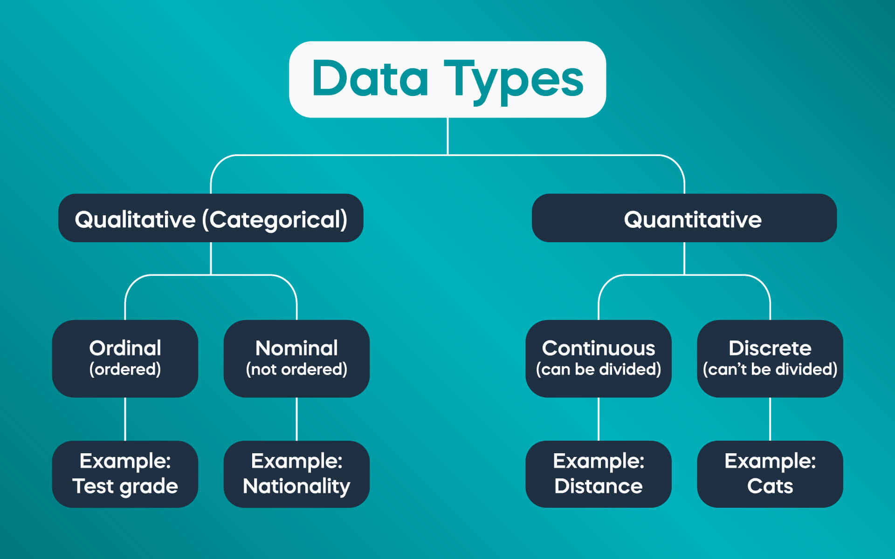
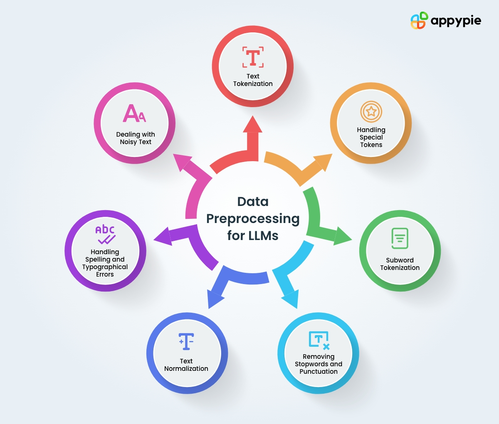

Data preprocessing for LLMs
==================================

Data is a collection of discrete values that convey information, describing quantity, quality, fact, statistics, other basic units of meaning, or simply sequences of symbols that may be further interpreted.

Data preprocessing is a crucial step in our pipeline since a bad data preprocessing leads to bad results. It involves a series of steps to prepare the raw text data for training. 
Effective preprocessing contributes to smoother training, faster convergence, and improved model performance. The goal is to standardize the input data to reduce the complexity that the model needs to handle.
Data preprocessing for large language model involves prominent techniques to pre-process its data.

Data cleaning
------------------------
Data cleaning is a fundamental aspect of data pre-processing for training LLMs. This technique involves identifying and rectifying inaccuracies, inconsistencies, and irrelevant elements within the raw text data. 

Data cleaning methods 
------------------------
1. Handling missing values
   ~~~~~~~~~~~~~~~~~~~~~~~~~~~~~~~~
   Missing values can occur when there is no data for some observations or features in a dataset. These gaps in data can lead to inaccurate predictions or a biased model.
   To handle missing value, we have the following techniques:
       
   1. Data imputation: is the substitution of an estimated value that is as realistic as possible for a missing or problematic data item.
        
      .. code-block:: python
         :linenos:

         import pandas as pd
         import numpy as np
         from sklearn.impute import SimpleImputer
         
         data = {'A': [1, 2, np.nan, 6, 14],'B': [11, np.nan, 14, 13, 10],'C': [2, 24, np.nan, 33, 84]}
         df = pd.DataFrame(data)
         print(df)
         
         imputer_mean = SimpleImputer(strategy='mean')
         df_mean_imputed = pd.DataFrame(imputer_mean.fit_transform(df), columns=df.columns)
         print(df_mean_imputed)
       
   2. Deletion: This involves removing rows or columns with missing values.

      .. code-block:: python
         :linenos:

         import pandas as pd
         import numpy as np

         data = {'A': [1, 2, np.nan, 6, 14],'B': [11, np.nan, 14, 13, 10],'C': [2, 24, np.nan, 33, 84]}
         df = pd.DataFrame(data)
         print(df)

         imputed = df.dropna()
         print(imputed)

2. Noise reduction
   ~~~~~~~~~~~~~~~~~~~~~~~~~~~~~~
   Noise in data refers to irrelevant or random information that can distort the true pattern and lead to inaccurate model predictions.

3. Consistency checks
   ~~~~~~~~~~~~~~~~~~~~~~~~~~~~~~
   Consistency checks ensure the data across the dataset adheres to consistent formats, rules, or conventions. Inconsistencies are caused by data entry errors or system glitches. These inconsistencies can lead to misleading results when training models.

4. Deduplication
   ~~~~~~~~~~~~~~~~~~~~~~~~~~~~~~~~~~~~~
   Duplicated data can occur for various reasons including data entry errors or system glitches. These duplicates can skew the data distribution and lead to biased model training. By removing duplicates, the dataset becomes more accurate and representative, improving the performance of the LLM.

      .. code-block:: python
         :linenos:

         data = {'Name': ['John', 'Alice', 'Bob', 'Charlie', 'John', 'Eve', 'Alice'],'Age': [25, 30, 22, 35, 25, 28, 30]}
         d1= pd.DataFrame(data)
         print(d1)
         d2 = d1.drop_duplicates()
         print(d2)

Text cleaning and normalization
-------------------------------
Removing noise and normalization 
-----------------------------
Removing noise from text and standardizing it are crucial steps for improving the quality of our textual data and enhancing the performance of the natural language processing tasks. Many techniques are used to fix this issue.

1. Lowercasing
~~~~~~~~~~~~~~~~~~~~~~~~~~~~~~
   Lowercasing is a text preprocessing step where all letters in the text are converted to lowercase. This step is implemented so that the algorithm does not treat the same words differently in different situations.
   
   .. code-block:: python
      :linenos:

      string = "ConvErT ALL tO LoWErCASe"
      print(string.lower())

2. Removing Punctuation and Special Characters
~~~~~~~~~~~~~~~~~~~~~~~~~~~~~~~~~~
   Punctuation and special characters removal is a text preprocessing step where you remove all punctuation marks (such as periods, commas, exclamation marks, emojis etc.) from the text to simplify it and focus on the words themselves.
   
   .. code-block:: python
      :linenos:

      test_str = "Gfg, is best : for ! Geeks ;"
      print("The original string is : " + test_str)
      punc = '''!()-[]{};:'"\,<>./?@#$%^&*_~'''
      for ele in test_str:
         if ele in punc:
            test_str = test_str.replace(ele, "")
      print("The string after punctuation filter : " + test_str)

3. Stop-words Removal 
~~~~~~~~~~~~~~~~~~~~~~~~~~~~~~
   Stop-words are the most common words in any language (like articles, prepositions, pronouns, conjunctions, etc) and do not add much information to the text. Examples of a few stop words in English are “the”, “a”, “an”, “so”, “what”.
   For this technique, we will use the NLTK library.
      
   .. code-block:: python
      :linenos:

      from nltk.corpus import stopwords
      from nltk.tokenize import word_tokenize

      nltk.download('punkt')
      example_sent = """This is a sample sentence, showing off the stop words filtration."""
      stop_words = set(stopwords.words('english'))
      word_tokens = word_tokenize(example_sent)
      filtered_sentence = [w for w in word_tokens if not w.lower() in stop_words]
      filtered_sentence = []
      for w in word_tokens:
         if w not in stop_words:
            filtered_sentence.append(w)
      print(word_tokens)
      print(filtered_sentence)

4. Removing URL
~~~~~~~~~~~~~~~~~~~~~~~~~~~~~~
   This preprocessing step is to remove any URLs present in the data.
      
   .. code-block:: python
      :linenos:

      import re
      def remove_urls(text, replacement_text="[URL REMOVED]"):
         url_pattern = re.compile(r'https?://\S+|www\.\S+')
         text_without_urls = url_pattern.sub(replacement_text, text)
         return text_without_urls
      # Example
      input_text = "Visit on GeeksforGeeks Website: https://www.geeksforgeeks.org/"
      output_text = remove_urls(input_text)
      print("Original Text:")
      print(input_text)
      print("\nText with URLs Removed:")
      print(output_text)

5. Removal of HTML Tags
~~~~~~~~~~~~~~~~~~~~~~~~~~~~~
   It’s important to remove HTML tags from the text data. Indeed, if we work with text data obtained from HTML sources, the text may contain HTML tags, which are not desirable for text analysis. 
      
   .. code-block:: python
      :linenos:

      import re
      from bs4 import BeautifulSoup

      def remove_html_tags_beautifulsoup(text):
         soup = BeautifulSoup(text, 'html.parser')
         return soup.get_text()

      html_text = "
This is <b>HTML</b> text.
"
      cleaned_text_bs4 = remove_html_tags_beautifulsoup(html_text)

      print("Original HTML text:", html_text)
      print("Text after HTML tag removal (BeautifulSoup):", cleaned_text_bs4)

6. Stemming
~~~~~~~~~~~~~~~~~~~
   Stemming is a linguistic normalization that simplifies words to their base form or root by removing prefixes and suffixes, helping the natural language processing and information retrieval.
   
   .. code-block:: python
      :linenos:

      import nltk
      from nltk.stem import PorterStemmer

      nltk.download("punkt")
      ps = PorterStemmer()
      example_words = ["program", "programming", "programer", "programs", "programmed"]
      print("{0:20}{1:20}".format("--Word--", "--Stem--"))
      for word in example_words:
         print("{0:20}{1:20}".format(word, ps.stem(word)))

7. Lemmatization
~~~~~~~~~~~~~~~~~~~~~~~~
   Lemmatization simplifies words to their base or root form, known as the lemma, making it easier to analyze a word. The difference between stemming and lemmatization is that the latter transforms words to their standardized form and aims to return a valid word by applying linguistic rules and context.
   
   .. figure:: ../Images/DifferencebetweenStemmingandLemmatization.jpg
    :width: 80%
    :align: center
    :alt: Alternative text for the image

   .. code-block:: python
      :linenos:

      from nltk.stem import WordNetLemmatizer
      nltk.download("wordnet")
      nltk.download("omw-1.4") 
      wnl = WordNetLemmatizer()
      example_words = ["program", "programming", "programer", "programs", "programmed"]
      print("{0:20}{1:20}".format("--Word--", "--Lemma--"))
      for word in example_words:
         print("{0:20}{1:20}".format(word, wnl.lemmatize(word, pos="v")))

8.Removing redundant whitespace
~~~~~~~~~~~~~~~~~~~~~~~~~~~~~~
 Removing redundant whitespace is  an essential step in text preprocessing to ensure a clean and standardized representation of the text. Extra whitespaces can lead to inconsistencies and negatively impact the performance of natural language processing (NLP) tasks.

   .. code-block:: python
      :linenos:

      import re

      test_str = "GfG is good         website"
      print("The original string is : " + test_str)
      res = re.sub(' +', ' ', test_str)
      print("The strings after extra space removal : " + str(res))

9.Removing numbers
   .. code-block:: python
      :linenos:

      ini_string = "Giant12for17giant"
      print("initial string : ", ini_string)
      res = ''.join([i for i in ini_string if not i.isdigit()])
      print("final string : ", res)

Tokenization and word embedding
--------------------------------
Tokenization, in the realm of Natural Language Processing (NLP) and machine learning, refers to the process of converting a sequence of text into smaller parts, known as tokens. These tokens can be as small as characters or as long as words.
The aim of tokenization is to represent text in a manner that's meaningful for machines without losing its context.
   .. figure:: ../Images/TypesOfTokenization.jpg
    :width: 80%
    :align: center
    :alt: Alternative text for the image

Tokenization algorithms
~~~~~~~~~~~~~~~~~~~~~~~~~~~~~
  1.Byte pair encoding (BPE)
  
BPE is a simple form of data compression algorithm in which the most common pair of consecutive bytes of data is replaced with a byte that does not occur in that data.
Suppose we have data aaabdaaabac which needs to be encoded (compressed). The byte pair aa occurs most often, so we will replace it with Z as Z does not occur in our data.
      
BPE algorithm
~~~~~~~~~~~~~~~~~~~~~~~~~~~~~~~~~~~~~~~~~~~~~

1.Initialize Vocabulary: Start with a vocabulary that consists of all the characters or tokens in the dataset.

2.Calculate Frequencies: Calculate the frequency of each character or token pair in the dataset.

3.Merge Most Frequent Pair: Identify the most frequent pair of characters or tokens in the dataset, and merge them into a new token. Update the vocabulary accordingly.

4.Repeat: Repeat steps 2 and 3 for a fixed number of iterations or until a certain condition is met (e.g., reaching a predefined vocabulary size).

5.Encoding: Once the vocabulary is constructed, encode the input text by replacing each token with its corresponding token in the vocabulary.

.. raw:: html

   <iframe width="560" height="315" src="https://www.youtube.com/embed/i0D5GbudU6c" frameborder="0" allowfullscreen></iframe>

Sentence Piece Tokenization
~~~~~~~~~~~~~~~~~~~~~~~~~~~~~
SentencePiece is an unsupervised text tokenizer(a tokenizer breaks down text into smaller subword units) and detokenizer(a detokenizer reconstructs the original text from a sequence of subword units, ensuring proper formatting and coherence) primarily designed for Neural Network-based text generation tasks. It supports multiple languages with a single model and can tokenize text into subwords, making it versatile for various NLP tasks.

Sentence algorithm
~~~~~~~~~~~~~~~~~~~~~~~~~~~~~~~

1.Training:The algorithm begins by training on a large corpus of text data.During training,it learns a vocabulary of subword units based on the frequency of character sequences in the training data.

2.Tokenization:Once the algorithm is trained , it can tokenize new text inputs.It segments the input text into subword units using the learned vocabulary.

3. Detokenization: SentencePiece merges subword units according to the rules learned during training, effectively reversing the tokenization process from tokens to sentences.

   .. figure:: ../Images/SentencePiece.jpg
     :width: 80%
     :align: center
     :alt: SentencePiece Tokenization

   