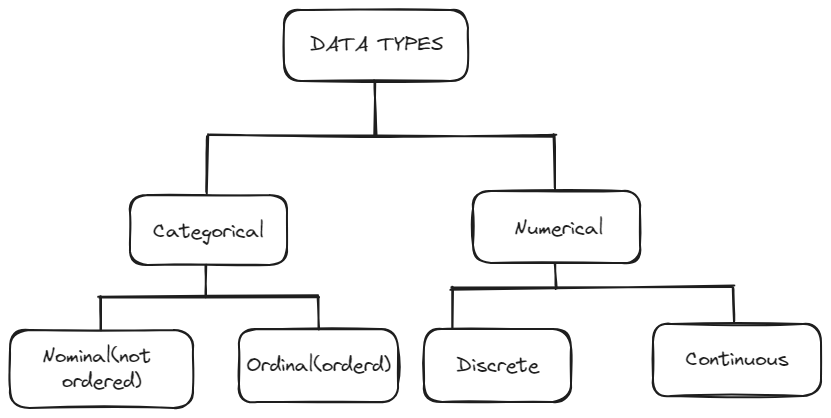
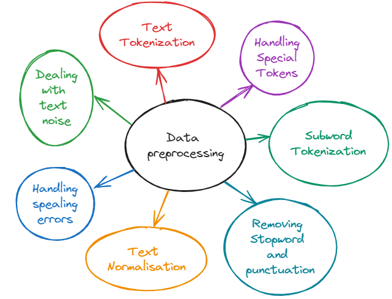
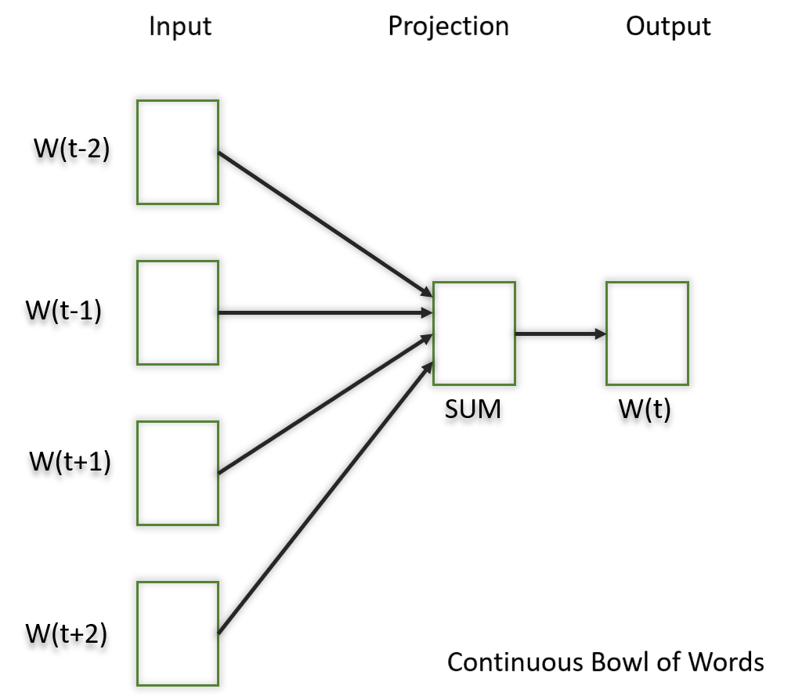
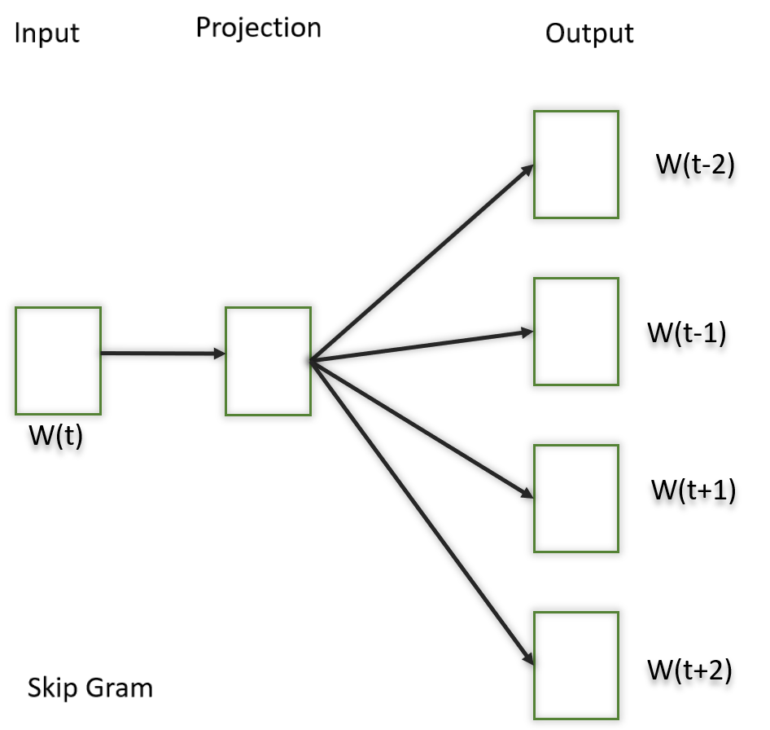

Data preprocessing for LLMs
==================================
Data: What's It All About?
---------------------------
Data is information collected or generated for analysis and interpretation. It encompasses a wide range of formats, including numerical values, textual content, images, and more. In the realm of computing and analysis, data serves as the cornerstone for deriving insights, facilitating informed decision-making, and driving innovation.

Data Preprocessing and LLMs
-----------------------------
Data preprocessing is a pivotal phase in our pipeline, essential for achieving high-quality results. It encompasses refining raw text data to ensure smoother training, faster convergence, and superior model performance. By standardizing input data and employing specialized techniques tailored for large language models, we effectively reduce complexity and enhance overall efficiency.

Data cleaning
============================
.. note::
   Data cleaning is a fundamental aspect of data pre-processing for training LLMs. This technique involves identifying and rectifying inaccuracies, inconsistencies, and irrelevant elements within the raw text data. 

Data cleaning methods :
------------------------
1. Handling missing values
------------------------------
   In any dataset, missing values can crop up when certain observations or features lack data. These gaps pose a significant challenge, potentially skewing predictions and introducing bias into our models. To prevent this, we need to address missing values effectively, ensuring our predictions remain reliable and accurate.

2. Noise reduction
-----------------------------------
   Think of data noise as those pesky distractions – irrelevant or random bits of information that sneak into our dataset. They're like static on a radio, distorting the true signal and making it harder for our models to predict accurately. By filtering out this noise, we can unveil the genuine patterns hiding within our data and make more reliable predictions.

3. Consistency checks
-----------------------------------
.. warning::
   Consistency checks are like quality control for data, making sure everything follows the same formats and rules. When data doesn't match up due to errors or glitches, it can cause confusion and inaccuracies in model training.

4. Deduplication
-----------------------------------
   Duplicates in data often stem from errors during data entry or glitches in the system. These duplicates can skew the distribution of data and result in biased model training. By eliminating duplicates, we ensure the dataset is more accurate and representative, thereby improving the performance of the LLM.

Text cleaning and normalization
========================================

Removing noise and normalization 
-----------------------------
Removing noise from text and standardizing it are essential for enhancing the quality of our textual data, which in turn improves the performance of natural language processing tasks. Various techniques and tools are available to address these challenges.

.. note::
To effectively manage this task, we can utilize several libraries that are designed to help clean and standardize text data. These libraries provide robust functionalities for preprocessing text, making it cleaner and more uniform for subsequent analysis.

1. Lowercasing
~~~~~~~~~~~~~~~~~~~~~~

   Lowercasing is a text preprocessing step where all letters in the text are converted to lowercase. This step is implemented so that the algorithm does not treat the same words differently in different situations.
   

2. Removing Punctuation and Special Characters
~~~~~~~~~~~~~~~~~~~~~~~~~~~~~~~~~~~~~~~~~~~~~~~~
   Punctuation and special characters removal is a text preprocessing step where you remove all punctuation marks (such as periods, commas, exclamation marks, emojis etc.) from the text to simplify it and focus on the words themselves.
   
3. Stop-words Removal 
~~~~~~~~~~~~~~~~~~~~~~~~~
   Stop-words are the most common words in any language (like articles, prepositions, pronouns, conjunctions, etc) and do not add much information to the text. Examples of a few stop words in English are “the”, “a”, “an”, “so”, “what”.
   For this technique, we will use the NLTK library.
      

4. Removing URL
~~~~~~~~~~~~~~~~~~~~~~~~~~~~~~
   This preprocessing step is to remove any URLs present in the data.

5. Removal of HTML Tags
~~~~~~~~~~~~~~~~~~~~~~~~~~~~~~~~~~
   It’s important to remove HTML tags from the text data. Indeed, if we work with text data obtained from HTML sources, the text may contain HTML tags, which are not desirable for text analysis. 
      
6. Stemming
~~~~~~~~~~~~~~~~~~~~~~~~~~~~~~~~~~~~~
   Stemming is a linguistic normalization that simplifies words to their base form or root by removing prefixes and suffixes, helping the natural language processing and information retrieval.
   
7. Lemmatization
~~~~~~~~~~~~~~~~~~~~~~~~~~~~~~~~~~~~~~~~

   Lemmatization simplifies words to their base or root form, known as the lemma, making it easier to analyze a word. The difference between stemming and lemmatization is that the latter transforms words to their standardized form and aims to return a valid word by applying linguistic rules and context.
   
   .. warning::
      The difference between  Lemmatization and Stemming is simple :Lemmatization reduces words to their canonical form,while stemming reduces them to their root form
   
   
   .. figure:: ../Images/DifferencebetweenStemmingandLemmatization.jpg
    :width: 80%
    :align: center
    :alt: Alternative text for the image

8.Removing redundant whitespace
~~~~~~~~~~~~~~~~~~~~~~~~~~~~~~~~~~~~~~~~~

 Removing redundant whitespace is  an essential step in text preprocessing to ensure a clean and standardized representation of the text. Extra whitespaces can lead to inconsistencies and negatively impact the performance of natural language processing (NLP) tasks.

9.Removing numbers
~~~~~~~~~~~~~~~~~~~~~~~~~~~~~~~~~~~~~~~~~~~

Preprocessing lab
~~~~~~~~~~~~~~~~~~~~~~~~~~~~~~~~~~~
.. button::
   :text: LAB
   :link: https://colab.research.google.com/drive/1Fn0fZ2HdctgrS_kcgwhaf1nYbqptrjsu?usp=sharing

.. note::
   After preprocessing our data, the next step will be to feed it into our large language model. The concern here is whether our LLM will have a very good understanding of our cleaned data. In this context, we will discuss an important concept known as Tokenization.

Tokenization and word embedding
--------------------------------
Tokenization and word embedding are crucial steps in natural language processing (NLP) that help convert textual data into numerical formats that can be easily processed by machine learning models.

1.Tokenization
----------------
Definition
~~~~~~~~~~
Tokenization, in the realm of Natural Language Processing (NLP) and machine learning, refers to the process of converting a sequence of text into smaller parts, known as tokens. These tokens can be as small as characters or as long as words.
The aim of tokenization is to represent text in a manner that's meaningful for machines without losing its context.

Types of Tokenization
~~~~~~~~~~~~~~~~~~~~~
1. **Word Tokenization**: Splits text into individual words.
   
   - Example: "Hello, world!" becomes ["Hello", ",", "world", "!"]
   
2. **Sentence Tokenization**: Splits text into individual sentences.
   
   - Example: "Hello world. How are you?" becomes ["Hello world.", "How are you?"]
   
3. **Subword Tokenization**: Breaks words into subword units, often used in transformer models like BERT.
   
   - Example: "unhappiness" becomes ["un", "##happiness"]
   
   .. figure:: ../Images/TypesOfTokenization.jpg
    :width: 80%
    :align: center
    :alt: Alternative text for the image

Libraries for Tokenization
~~~~~~~~~~~~~~~~~~~~~~~~~
- **NLTK (Natural Language Toolkit)**: Provides functions for word and sentence tokenization along with additional NLP functionalities like stemming, lemmatization, and POS tagging.

  .. code:: python

     # Importing necessary functions from NLTK
     import nltk
     from nltk.tokenize import word_tokenize, sent_tokenize

     # Download the NLTK data files (only the first time)
     nltk.download('punkt')
     nltk.download('averaged_perceptron_tagger')
     nltk.download('wordnet')

     # Input text
     text = "Hello world. How are you?"

     # Word tokenization
     words = word_tokenize(text)

     # Sentence tokenization
     sentences = sent_tokenize(text)

     # Part-of-Speech (POS) tagging
     pos_tags = nltk.pos_tag(words)

     # Lemmatization
     from nltk.stem import WordNetLemmatizer
     lemmatizer = WordNetLemmatizer()
     lemmas = [lemmatizer.lemmatize(word) for word in words]

     # Output results
     print("Word Tokenization:", words)
     print("Sentence Tokenization:", sentences)
     print("POS Tagging:", pos_tags)
     print("Lemmatization:", lemmas)

  **Output:**

  .. code:: text

     Word Tokenization: ['Hello', 'world', '.', 'How', 'are', 'you', '?']
     Sentence Tokenization: ['Hello world.', 'How are you?']
     POS Tagging: [('Hello', 'NNP'), ('world', 'NN'), ('.', '.'), ('How', 'WRB'), ('are', 'VBP'), ('you', 'PRP'), ('?', '.')]
     Lemmatization: ['Hello', 'world', '.', 'How', 'are', 'you', '?']

- **spaCy**: Efficient tokenization and additional NLP functionalities such as POS tagging, named entity recognition (NER), and dependency parsing.

  .. code:: python

     # Importing spaCy and loading the English model
     import spacy

     # Load the small English model
     nlp = spacy.load("en_core_web_sm")

     # Input text
     text = "Hello world. How are you?"

     # Processing the text through the spaCy pipeline
     doc = nlp(text)

     # Extracting tokens
     tokens = [token.text for token in doc]

     # POS tagging
     pos_tags = [(token.text, token.pos_) for token in doc]

     # Named Entity Recognition (NER)
     entities = [(entity.text, entity.label_) for entity in doc.ents]

     # Dependency Parsing
     dependencies = [(token.text, token.dep_, token.head.text) for token in doc]

     # Output results
     print("spaCy Tokenization:", tokens)
     print("POS Tagging:", pos_tags)
     print("Named Entities:", entities)
     print("Dependencies:", dependencies)

  **Output:**

  .. code:: text

     spaCy Tokenization: ['Hello', 'world', '.', 'How', 'are', 'you', '?']
     POS Tagging: [('Hello', 'INTJ'), ('world', 'NOUN'), ('.', 'PUNCT'), ('How', 'ADV'), ('are', 'AUX'), ('you', 'PRON'), ('?', 'PUNCT')]
     Named Entities: []
     Dependencies: [('Hello', 'intj', 'Hello'), ('world', 'ROOT', 'world'), ('.', 'punct', 'world'), ('How', 'advmod', 'are'), ('are', 'ROOT', 'are'), ('you', 'nsubj', 'are'), ('?', 'punct', 'are')]

- **transformers**: Tokenization for transformer-based models, and access to pre-trained transformer models for tasks such as text classification, named entity recognition, and question answering.

  .. code:: python

     # Importing the BertTokenizer from transformers library
     from transformers import BertTokenizer

     # Loading the BERT tokenizer
     tokenizer = BertTokenizer.from_pretrained('bert-base-uncased')

     # Input text
     text = "Hello world. How are you?"

     # Tokenizing the text using BERT tokenizer
     tokens = tokenizer.tokenize(text)

     # Output results
     print("BERT Tokenization:", tokens)

  **Output:**

  .. code:: text

     BERT Tokenization: ['hello', 'world', '.', 'how', 'are', 'you', '?']

2.Word Embedding
---------------
Definition
~~~~~~~~~~
Word embedding is a technique to represent words in continuous vector space where semantically similar words are mapped to nearby points.

Purpose
~~~~~~~
- To capture the semantic meaning of words.
- To reduce the dimensionality of text data for easier processing by machine learning models.
Types of Word Embeddings
~~~~~~~~~~~~~~~~~~~~~~~~

1. **One-Hot Encoding**
-----------------------

One-hot encoding is a basic and straightforward method to represent words. Each word in the vocabulary is represented as a binary vector, where only the index corresponding to that word is set to 1, and all other indices are set to 0.

   - **Example**: In a vocabulary of three words ["cat", "dog", "fish"], the one-hot encodings would be:
     - "cat" -> [1, 0, 0]
     - "dog" -> [0, 1, 0]
     - "fish" -> [0, 0, 1]
   
   - **Advantages**:
     - Simple to implement.
     - Intuitive and easy to understand.
   
   - **Limitations**:
     - High dimensionality: For a large vocabulary, the vectors become very large and sparse.
     - No semantic meaning: Does not capture any relationship between words. "cat" and "dog" are as dissimilar as "cat" and "fish".

2. **Word2Vec**
-----------------------
Word2Vec is a popular word embedding technique that produces dense, continuous vector representations of words. It uses neural networks to learn the embeddings from large corpora of text. Word2Vec offers two models:

   - **CBOW (Continuous Bag of Words)**:
     - Predicts the target word from the context words.
     - Faster and works well with frequent words.
   
   - **Skip-gram**:
     - Predicts the context words from the target word.
     - Better for smaller datasets and rare words.
2.1 Continuous Bag of Words
~~~~~~~~~~~~~~~~~~~~~~~~~~~~~~~~~~~
CBOW aims to predict a target word based on its context, which consists of the surrounding words in a given window.
It a feedforward neural network with a single hidden layer. The input layer represents the context words, and the output layer represents the target word. The hidden layer contains the learned continuous vector representations (word embeddings) of the input words.
    

2.2 Skip-gram
~~~~~~~~~~~~~~~~~~~~~~~~~~~~~~~~~

Skip-gram is a slightly different word embedding technique in comparison to CBOW as it does not predict the current word based on the context.This variant takes only one word as an input and then predicts the closely related context words. That is the reason it can efficiently represent rare words.

.. button::
   :text: LAB
   :link: https://colab.research.google.com/drive/1CyXTqirDsrtinleQc-s6ArX-Dpi0Lo7Q?usp=sharing

3. **Bag of Words (BOW)**
-----------------------
Bag of Words (BOW) is a simple but powerful approach to vectorizing text. As the name suggests, the bag-of-words technique does not consider the position of a word in a document. Instead, all the words are dropped into a big bag. The idea is to count the number of times each word appears in each document without considering its position or grammatical role.

   - **Example**: Consider the three following sentences from the well-known Surfin’ Bird song, and count the number of times each word appears in each sentence. Let’s first list all the words in the verses:

   .. figure:: ../Images/BOW.png
      :width: 80%
      :align: center
      :alt: BOW on Surfin’ Bird

   Each word is now associated with its own column of numbers, its own vector:

   .. figure:: ../Images/BOW2.png
      :width: 80%
      :align: center
      :alt: Each word has its own vector

   .. note::
      The matrix calculated on this simple example of three sentences can be generalized to many documents in the corpus. Each document is a row, and each token is a column. Such a matrix is called the document-term matrix. It describes the frequency of terms that occur in a collection of documents and is used as input to a machine learning classifier.
      
      Note that the size of the document-term matrix is: number of documents * size of vocabulary.
      
      The vector size of each token equals the number of documents in the corpus. With this BOW approach, a large corpus has long vectors, and a small corpus has short vectors (as in the Surfin’ Bird example above, where each vector only has three numbers).

   .. note::
      A corpus is a set of texts or documents. A document is any distinct text varying in size, format, or structure and can include sentences, paragraphs, tweets, SMS, comments, reviews, articles, books, etc.
   

Tokenization algorithms
~~~~~~~~~~~~~~~~~~~~~~~~~~~~~
  1.Byte pair encoding (BPE)
  
BPE is a simple form of data compression algorithm in which the most common pair of consecutive bytes of data is replaced with a byte that does not occur in that data.
Suppose we have data aaabdaaabac which needs to be encoded (compressed). The byte pair aa occurs most often, so we will replace it with Z as Z does not occur in our data.
      
BPE algorithm
~~~~~~~~~~~~~~~~~~~~~~~~~~~~~~~~~~~~~~~~~~~~~

1.Initialize Vocabulary: Start with a vocabulary that consists of all the characters or tokens in the dataset.

2.Calculate Frequencies: Calculate the frequency of each character or token pair in the dataset.

3.Merge Most Frequent Pair: Identify the most frequent pair of characters or tokens in the dataset, and merge them into a new token. Update the vocabulary accordingly.

4.Repeat: Repeat steps 2 and 3 for a fixed number of iterations or until a certain condition is met (e.g., reaching a predefined vocabulary size).

5.Encoding: Once the vocabulary is constructed, encode the input text by replacing each token with its corresponding token in the vocabulary.

BPE lab
~~~~~~~~~~~~~~~~~~~~~~~~~~~~~~~~~~~
.. button::
   :text: BPE LAB
   :link: https://colab.research.google.com/drive/1pWYPIPiazp8btdIDxOYl_zeRnNa_G3Jv?usp=sharing

Sentence Piece Tokenization
~~~~~~~~~~~~~~~~~~~~~~~~~~~~~
SentencePiece is an unsupervised text tokenizer(a tokenizer breaks down text into smaller subword units) and detokenizer(a detokenizer reconstructs the original text from a sequence of subword units, ensuring proper formatting and coherence) primarily designed for Neural Network-based text generation tasks. It supports multiple languages with a single model and can tokenize text into subwords, making it versatile for various NLP tasks.

Sentence Piece algorithm
~~~~~~~~~~~~~~~~~~~~~~~~~~~~~~~

1.Training:The algorithm begins by training on a large corpus of text data.During training,it learns a vocabulary of subword units based on the frequency of character sequences in the training data.

2.Tokenization:Once the algorithm is trained , it can tokenize new text inputs.It segments the input text into subword units using the learned vocabulary.

3.Detokenization: SentencePiece merges subword units according to the rules learned during training, effectively reversing the tokenization process from tokens to sentences.
   
   .. figure:: ../Images/SentencePiece.png
    :width: 80%
    :align: center
    :alt: SentencePiece Tokenization

Word embedding
~~~~~~~~~~~~~~~~~~~~~~~
Word embedding or known as word vector is an approach with which we represent documents and words. It is defined as a numeric vector input that allows words with similar meanings to have the same representation.

Algorithms for word embedding
~~~~~~~~~~~~~~~~~~~~~~~~~~~~~~
1.Word2Vec
~~~~~~~~~~~~~~~~~~~~~
Word2Vec is a neural approach for generating word embeddings.It is a shallow, two-layer neural network trained to reconstruct linguistic contexts of words. It takes a large corpus as input and generates a vector space, usually with several hundred dimensions. Each unique word in the corpus is assigned a vector in this space, positioning words with common contexts close to each other.
There are two neural embedding methods for Word2Vec :Continuous Bag of Words(CBOW) and Skip-gram
 
1.1 Continuous Bag of Words
~~~~~~~~~~~~~~~~~~~~~~~~~~~~~~~~~~~
CBOW aims to predict a target word based on its context, which consists of the surrounding words in a given window.
It a feedforward neural network with a single hidden layer. The input layer represents the context words, and the output layer represents the target word. The hidden layer contains the learned continuous vector representations (word embeddings) of the input words.
    

1.2 Skip-gram
~~~~~~~~~~~~~~~~~~~~~~~~~~~~~~~~~

Skip-gram is a slightly different word embedding technique in comparison to CBOW as it does not predict the current word based on the context.This variant takes only one word as an input and then predicts the closely related context words. That is the reason it can efficiently represent rare words.

.. button::
   :text: LAB
   :link: https://colab.research.google.com/drive/1CyXTqirDsrtinleQc-s6ArX-Dpi0Lo7Q?usp=sharing

   