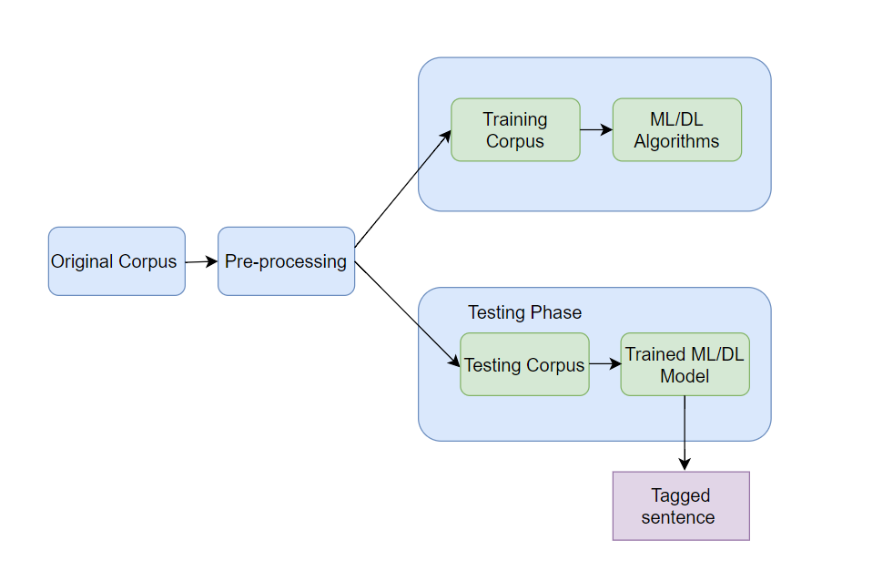
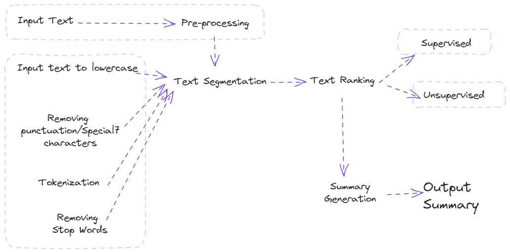

Applications of LLMs
===================

Natural Language Processing (NLP) Tasks
---------------------------------------

Natural Language Processing (NLP) is a branch of artificial intelligence (AI) aimed at reaching human-computer interaction through the natural language. Its goal is to enable computers to understand, interpret, and respond to human language in a meaningful manner.

Practical uses of NLP encompass speech recognition, machine translation, sentiment analysis, and entity extraction.

Large Language Models (LLMs), a significant advancement in NLP, leverage increased computing capabilities, abundant data, and machine learning innovations. By digesting vast text corpora, these models discern language patterns, grammatical rules, world knowledge, and reasoning capabilities.

   NLp use cases.

Sentiment Analysis
------------------
Sentiment analysis not only assesses the general sentiment polarity of text (positive, negative, neutral) but also goes into detecting specific emotions (e.g., joy, frustration, anger, sorrow), levels of urgency (urgent, non-urgent), and intentions (interested vs. uninterested)

.. figure:: ../Images/sentiment.png
   :alt: Alternative text for the image
   :align: center

   Customer Feed-Back Sentiment Classification

Graded Sentiment Analysis (Fine-Grained Sentiment Analysis)
^^^^^^^^^^^^^^^^^^^^^^^^^^^^^^^
For businesses where understanding the precise level of sentiment is necessary, expanding the range of sentiment categories to capture various degrees of positivity or negativity can be beneficial:

- Very positive

- Positive

- Neutral

- Negative

- Very negative

Emotion Detection
^^^^^^^^^^^^^^^^^
This approach extends beyond simple polarity to identify specific emotions, such as happiness, frustration, anger, or sadness.

Aspect-Based Sentiment Analysis
^^^^^^^^^^^^^^^^^^^^^^^^^^^^

This analysis focuses on identifying sentiments related to specific aspects or features mentioned in texts, determining whether the sentiments are positive, neutral, or negative.
For instance, in the review, "The battery life of this laptop is too short", aspect-based analysis would pinpoint the negative sentiment directed towards the laptop's battery life.

Example:Sentiment Analysis with Python and NLTK

Objective:To determine the sentiment of a given text (positive, negative, or neutral) using the NLTK library.

`Hands on for Sentiment Analysis`_.

.. _Hands on for Sentiment Analysis: https://colab.research.google.com/drive/1_YIDvSwWqgXW8OasKAA3IW1gYSnAfs_o?authuser=0#scrollTo=XwDS1lJj3r2G

Named Entity Recognition (NER)
------------------------------
Named entity recognition (NER) — sometimes referred to as entity chunking, extraction, or identification — is the task of identifying and categorizing key information (entities) in text. An entity can be any word or series of words that consistently refers to the same thing. Every detected entity is classified into a predetermined category. For example, an NER machine learning (ML) model might detect the word "ENSAM" in a text and classify it as a "College".

How does NER works?
At the heart of any NER model is a two step process:
-Detect a named entity
-Categorize the entity

Step one involves detecting a word or string of words that form an entity.Each word represents a token:The ATLAS mountains” is a string of three tokens that represents one entity.

The second step requires the creation of entity categories.
To learn what is and is not a relevant entity and how to categorize them, a model requires training data. The more relevant that training data is to the task, the more accurate the model will be at completing said task.

   Example of NER e.g Name Entity Recognition

Example:Named Entity Recognition (NER)

Objective:NER capabilities using spaCy to identify various types of entities in a text, such as persons, organizations, locations...

`Hands On for NER`_.

.. _Hands On for NER: https://colab.research.google.com/drive/1qF4IBkVMKc9XLOCJIi21uo6aVIddhQCC#scrollTo=jH7gBXJA6Bcy

Part-Of-Speech Tagging (PoS)
---------------------------
Part-of-speech tagging, a fundamental aspect of natural language processing, involves assigning syntactic tags to each word in a sentence based on its context. Also known as grammatical tagging, this process categorizes words into grammatical groups like verbs, adjectives, nouns, etc.

   
   Use of ML/DL in PoS

.. table:: Example of Part of Speech Tags
   :name: tab:pos_tags

   +----------------+------+
   | Part of Speech | Tag  |
   +================+======+
   | Noun           | n    |
   +----------------+------+
   | Verb           | v    |
   +----------------+------+
   | Adjective      | a    |
   +----------------+------+
   | Adverb         | r    |
   +----------------+------+

Words behave differently given different contexts in most languages, and thus the difficulty is to identify the correct tag of a word appearing in a particular sentence. Several approaches have been deployed to automatic POS tagging, like transformational-based, rule-based and probabilistic approaches.

Rule-Based POS Tagging
^^^^^^^^^^^^^^^^^^
This traditional method utilizes a lexicon to suggest possible tags for each word. Disambiguation is achieved through hand-written rules considering the word's context and neighboring words.

Defining a set of rules for assigning POS tags to words. For example:

+If the word ends in “-tion,” assign the tag “noun.”

+If the word ends in “-ment,” assign the tag “noun.”

+If the word is all uppercase, assign the tag “proper noun.”

+If the word is a verb ending in “-ing,” assign the tag “verb.”

Example:PoS tagging

Objective:how to perform PoS tagging on a given sentence, assigning grammatical parts of speech to each word, such as nouns, verbs, adjectives, etc.

`Hands on for Pos Tagging`_

.. _Hands on for Pos Tagging: https://colab.research.google.com/drive/1TrphG2ueaYbu1TOD0lk_koTp55LGJiLs#scrollTo=myAoNkvTCdf-

Artificial Neural Networks (ANN)
^^^^^^^^^^^^^^^^^^^^^^^^
ANNs for POS tagging involve preprocessing to prepare input for the network. The network then adjusts its weights during training to predict accurate tags.

   Use of ML/DL in PoS
   

Transformation-Based Tagging (TBT)
^^^^^^^^^^^^^^^^^^^^^^^^
TBT applies rules to transform word tags based on their context. Unlike rule-based tagging, TBT dynamically updates tags by applying rules in sequence, such as changing a verb to a noun if preceded by a determiner.
In TBT, a set of rules is defined to transform the tags of words in a text based on the context in which they appear. 

For example, a rule might change the tag of a verb to a noun if it appears after a determiner such as “the” .
The rules are applied to the text in a specific order, and the tags are updated after each transformation.
Here is an example of how a TBT system might work:
Defining a set of rules for transforming the tags of words in the text.

+If the word is a verb and appears after a determiner, change the tag to “noun”.

+If the word is a noun and appears after an adjective, change the tag to “adjective”.

+Iterate through the words in the text and apply the rules in a specific order.

For example: 

In the sentence “The cat sat on the mat ”, the word “sat” would be changed from a verb to a noun based on the first rule.

In the sentence “The red cat sat on the mat ”, the word “red” would be changed from an adjective to a noun based on the second rule.

Machine Translation
^^^^^^^^^^^^^^^^^^^
Machine Translation (MT) is a domain of computational linguistics that uses computer programs to translate text or speech from one language to another with no human involvement with the goal of relatively high accuracy, low errors, and effective cost.
The basic requirement in the complex cognitive process of machine translation is to understand the meaning of a text in the original (source) language and then restore it to the target (sink) language.

The primary steps in the machine translation process are:

-We need to decode the meaning of the source text in its entirety.

-We also require an in-depth knowledge of the grammar, semantics, syntax, idioms, etc. of the source language for this process.

-We then need to re-encode this meaning in the target language, which also needs the same in-depth knowledge as the source language to replicate the meaning in the target language.

Example:Machine Translation

Objective:emonstrating how to translate text from English to French using a pre-trained model..

`Hands on for Machine Translation`_

.. _Hands on for Machine Translation: https://colab.research.google.com/drive/1LYFiiQ8Isl5P3-pv6V9eF5EFkzoasOEf#scrollTo=ww1ZHb--KScs
Rule-based Machine Translation or RBMT
^^^^^^^^^^^^^^^^^^^^^^
Also called knowledge-based machine translation, these are the earliest set of classical methods used for machine translation.

These translation systems are mainly based on linguistic information about the source and target languages that are derived from dictionaries and grammar covering the characteristic elements of each language separately.

Corpus-based Machine Translation Approach or CBMT
^^^^^^^^^^^^^^^^^^^^^^^^^^^^^^
Corpus-Based Machine Translation uses bilingual parallel corpora as a foundational dataset to inform and guide the translation of new text. 

This method relies on extensive databases of raw text paired with their corresponding translations, utilizing these parallel texts to derive insights and patterns for translation tasks.

Example-based Machine Translation or EBMT
^^^^^^^^^^^^^^^^^^^^^^
Example-based machine translation systems are trained from bilingual parallel corpora where the sentence pairs contain sentences in one language with their translations into another.

The principle of translation by analogy is encoded to the example-based machine translation through the example translations that are used to train the system.

Here's a simplified example using English and French:
Suppose we have a bilingual corpus with the following sentence pairs:

   
   

Now, if we want to translate a new English sentence using the EBMT approach:

  

The EBMT system will:

1. Identify segments from the known examples that can be reused:
 -"The cat sat" can be matched with "Le chat s'est assis" from the first pair.
 
 -"by" can be associated with "au bord" from the second pair, though this is not a direct match.

2. Adjust for the new context:
-"The window" has no direct match, but based on "on the mat" and the structure of the French sentence, the system may infer the correct preposition "à" for the English "by."

3. Assemble the translated segments:
-"Le chat s'est assis" + "à" + "la fenêtre" (where "la fenêtre" is the translation of "the window").

4. Generate the translated sentence:

  

Here, the EBMT system uses fragments of known translations to construct the translation of a new sentence. It requires a comprehensive bilingual corpus to increase the accuracy and fluency of the translations it produces.

Text Generation and Summarization
-------------------------------------

Text Summarization Techniques ( extractive and abstractive summarization methods enabled by LLMs)
^^^^^^^^^^^^^^^^^^^^^^^^^^^^^^^^^^^^^

Text generation and summarization are two advanced applications of natural language processing (NLP) that leverage artificial intelligence to manipulate language data.

Text generation involves creating coherent and contextually relevant text based on input data. This AI-driven process can produce content ranging from chatbot responses to full-length articles, emulating human-like writing styles.

Text summarization, on the other hand, aims to condense a larger body of text into a concise summary, preserving the original message and critical information.

   Flowchart explaining Extractive VS Abstractive Summarization

Extractive Summarization
***********************

Extractive Summarization simply takes out the important sentences or phrases from the original text and joins them to form a summary.

A ranking algorithm is used, which assigns scores to each of the sentences in the text based on their relevance to the overall meaning of the document. The most relevant sentences are then chosen to be included in the summary.

   Flowchart explaining Extractive Summarization

There are various ways through which the ranking of sentences can be performed.
 -TF-IDF (term frequency-inverse document frequency)
 -Graph-based methods such as TextRank
 -Machine learning-based methods such as Support Vector Machines (SVM) and Random Forests.

Example:Extractive Summarization

Objective: Utilizing a pre-trained Large Language Model known as bert for
text summarization.

`Hands on for Extractive Summarization`_.

.. _Hands on for Extractive Summarization: https://colab.research.google.com/drive/1pUVjSR3izak6yhVH0ohC1MGMBnmpfT3-#scrollTo=v864N5gCt06T

Abstractive Summarization
***********************

The abstractive summarization method is an outline/summary or the basic idea
of a voluminous thing(text).

It analyses the input text and generates new phrases
or sentences that capture the essence of the original text and convey the same
meaning as the original text but more concisely.

The input text is analyzed by a neural network model that learns to generate
new phrases and sentences that capture the essence of the original text.

Example:Abstractive Summarization

Objective: Using the Hugging Face Transformers library in Python to perform abstractive summarization on a piece of text.

`Hands on for Abstactive Summarization`_.

.. _Hands on for Abstractive Summarization: https://colab.research.google.com/drive/1zuaTp-KivcLojIMNN_VO0Yki6y3meDJi#scrollTo=6qxpTgLZgSYs

LLMs relevance in context-aware Text Generation
^^^^^^^^^^^^^^^^^^^^^^^^^^^^^^^^^^^^^^^^^^^^^^

Large Language Models (LLMs) are important in generating context-aware text, as they excel in understanding and predicting language patterns based on extensive training data. These models can produce text that is not only grammatically correct but also contextually appropriate. 

Applications such as conversational AI, personalized content creation, and context-sensitive translations show this clearly.

Imagine you are using a digital assistant to draft an email, and you type the beginning of a sentence:

"Please find attached the..."

An LLM, utilizing its context-aware capabilities, would predict the next part of the sentence based on the context it has learned from training on vast amounts of text data. It might suggest completing the sentence with "report from our last meeting," "invoice for this month,"
or "document you requested," depending on the previous interactions, email content, or commonly recognized patterns.

To demonstrate the importance of context we will be looking at 
a classic example of a sentence that can be understood in two different ways:

.. figure:: ../Images/telescope.png
   :width: 60%
   :alt: Alternative text for the image
   :align: center

This sentence can be interpreted in two distinct contexts:

1.Observation through an instrument: The speaker used a telescope to see the man. Here, the telescope is an instrument that aids in seeing something at a distance.

2.Observation of a man carrying an instrument: The man being observed is holding or carrying a telescope. In this interpretation, the focus is on what the man has with him.

Scenario 1:

Observation through an Instrument
Given the context that emphasizes the act of using the telescope for observation, an AI model might continue the sentence or paragraph with something related to the observations made, the stars, the moon, or distant objects seen through the telescope.

Let's explore how an AI might handle each interpretation:

Scenario 2:

Observation of a Man Carrying an Instrument
If the context suggests that the focus is on a man who has a telescope, the AI might generate text that talks about the man's intentions, perhaps his plans for stargazing, or his physical appearance.

How AI Uses Context for Text Generation?
****************************************

Preceding Text
***********

**Role in Context Understanding**

*Definition and Importance:*

Preceding text refers to the sentences or paragraphs that come before a specific point in a text. AI models use this information to establish a framework or background for understanding ongoing discussions or narratives. This is crucial because it sets the stage for interpreting everything that follows.

*Mechanism:*

AI models analyze the preceding text to detect key themes, subjects, and the tone of the discourse. This is done using various natural language processing techniques, such as tokenization (breaking down the text into smaller units like words), parsing (analyzing the grammatical structure of sentences), and semantic analysis (understanding the meanings behind words and phrases).

*Practical Example:*

Consider a text discussing the solar system. If the preceding text covers topics like planets, orbits, and space exploration, the AI is primed to interpret any ambiguous terms like "Mercury" or "Mars" within the context of astronomy rather than mythology or other unrelated fields.

**Implications for Ambiguity Resolution**

*Significance in Text Interpretation:*

The context provided by preceding text is essential for resolving ambiguities. Ambiguity in language occurs when a word, phrase, or sentence has multiple meanings or interpretations. Accurate context understanding helps pinpoint which meaning is appropriate in the given situation.

*Operational Method:*

The model uses contextual clues from the preceding text to choose the most likely meaning of ambiguous terms or structures. This process involves probabilistic models that predict which interpretation best fits with the observed patterns and contexts in the training data.

*Illustrative Case:*

If a narrative leading up to a particular sentence involves detailed descriptions of baking and cake decorating techniques, the mention of "icing" would likely be understood as a confectionery term rather than as related to weather phenomena (like icing conditions in aviation), even if the term itself could fit in multiple contexts.

The AI uses the sentences or paragraphs that come before the ambiguous sentence to gauge the topic and the direction of the narrative. Is the focus on astronomy, or is it on people and their actions?

Subsequent Text
**************

**Role in Context Refinement**

*Definition and Importance:*

Subsequent text refers to the sentences or paragraphs that follow a specific point in a text. This is critical for AI models as it provides additional information that can refine or even redefine the context initially inferred from the preceding text.

*Mechanism:*

AI models can use subsequent text to "look ahead" and make more informed decisions about the current text. This capability is especially important in tasks like summarization or when the text must be adjusted based on future content.

*Practical Example:*

In a discussion that initially seems to focus on historical events but later references recent technological advancements, an AI model can use the subsequent text to adjust its understanding and responses to align with a more modern context.

**Implications for Retroactive Contextualization**

*Significance in Text Interpretation:* 

Being able to consider future text allows AI models to retrospectively adjust their understanding of an ambiguous term or sentence. This dynamic adjustment is crucial for maintaining coherence and relevance in generated content.

*Operational Method:* 

This involves revisiting and potentially revising the interpretation of earlier text based on new information. Models achieve this by maintaining a flexible representation of the text context that can be updated as new data comes in.

*Illustrative Case:* 

If a dialogue begins with ambiguous references that could relate to either sports or business (like "draft"), but subsequent text clearly discusses teams and players, the AI would reinterpret the initial mention as sports-related.

Training Data
**********

**Foundation of Knowledge**

*Definition and Importance:* 

Training data consists of the vast datasets used to train AI models. The quality, diversity, and size of this data directly influence the model's ability to understand and generate language.

*Mechanism:* 

AI models learn from patterns in the training data through techniques such as statistical modeling, neural network training, and machine learning algorithms. These patterns teach the AI typical and atypical uses of language, which it then applies to new text generation tasks.

*Practical Example:*

A model trained on a broad dataset including literary works, scientific papers, and online forums will have a well-rounded capability to generate text that feels natural in a variety of contexts.

**Learning from Examples**

*Significance in Model Training:* 

Exposure to diverse contexts in training helps the model learn the flexibility and nuance of language. It learns not only vocabulary but also the various structures and styles of communication.

*Operational Method:*

During training, the AI analyzes how words and phrases are used across different texts and learns to predict likely continuations based on context.

*Illustrative Case:* 

By seeing multiple examples where "apple" is used to mean a fruit in a cooking context and a tech company in a business context, the model learns to adjust its use of the word based on surrounding text cues.

Prompt Design
************

**Influence on Interpretation**

*Definition and Importance:*

The design of a prompt—how it is structured and what details it includes—can significantly steer an AI's interpretation of what the generated text should focus on.

*Mechanism:*

By strategically including or omitting certain information in a prompt, the designer can guide the AI towards more specific interpretations or creative directions.

*Practical Example*: 

A prompt explicitly mentioning a historical figure and a significant event will likely lead the AI to generate text focused on that figure and event, rather than on unrelated topics.

**Guidance through Explicit Context**

*Significance in Text Generation:*

Providing clear, explicit context in a prompt can drastically reduce ambiguity and increase the relevance of the AI's output.

*Operational Method:*

This involves using carefully chosen words and phrases to set boundaries or highlight specific themes that the AI should consider when generating text.

*Illustrative Case:* 

If a prompt is designed to generate a story about space exploration, mentioning specific terms like "Mars rover" and "space station" can ensure the AI maintains focus on space-related themes rather than veering off-topic.

Question Answering and Chatbots
--------------------------

Examples of Existing LLM-powered chatbots
^^^^^^^^^^^^^^^^^^^^^^^^^^^^^^^^^^^^^^^^

.. table:: Example of Part of Speech Tags
   :name: tab:pos_tags

   +----------------+--------------------------------------------------------------------------------------------------------------------------------------------------------------------------------------------------------------------------------------------------+
   | LLM                | Description                                                                                                                                                                                                                                  |
   +================+==================================================================================================================================================================================================================================================+
   | GPT-3(OpenAI)      | One of the most advanced and widely recognized LLM-powered chatbots, GPT-3 has been implemented in various applications, ranging from writing assistance to conversational agents, due to its deep understanding of language and context.    |
   +----------------+--------------------------------------------------------------------------------------------------------------------------------------------------------------------------------------------------------------------------------------------------+
   | BERT(Google)       | BERT (Bidirectional Encoder Representations from Transformers) has significantly enhanced chatbot functionalities in search applications, improving the understanding of user queries.                                                       |
   +----------------+--------------------------------------------------------------------------------------------------------------------------------------------------------------------------------------------------------------------------------------------------+
   | LaMDA(Google)      | A conversational AI model designed to converse on any topic, LaMDA is known for its nuanced understanding and generation of human-like text, making it suitable for more natural interaction in chatbot applications                         |
   +----------------+--------------------------------------------------------------------------------------------------------------------------------------------------------------------------------------------------------------------------------------------------+
   | XiaoIce(Microsoft) | A social chatbot designed to provide emotional engagement and companionship, XiaoIce interacts with users through conversational dialogue, showcasing the emotional intelligence aspect of LLM.                                              |       
   +----------------+--------------------------------------------------------------------------------------------------------------------------------------------------------------------------------------------------------------------------------------------------+

Applications of LLM-powered Chatbots
^^^^^^^^^^^^^^^^^^^^^^^^^^^^^^^^^^^^
Customer Support
*********
LLM-powered chatbots are deployed on websites and in apps to provide immediate responses to customer inquiries, reducing wait times and improving customer service efficiency.

Personal Assistants
***************
In smartphones and smart home devices, these chatbots help users perform tasks like setting reminders, answering questions, and controlling connected devices with natural language commands.

Education and Tutoring
****************
Chatbots equipped with LLMs can provide personalized tutoring, answer students' questions, and offer explanations on a wide range of topics, facilitating a more interactive learning experience.

Healthcare Assistance
******************
Virtual assistants in healthcare can triage patient inquiries, provide health information, and even offer preliminary diagnostic support based on symptoms described by the user.

Information Retrieval
*****************
LLM-powered chatbots enhance information retrieval systems by understanding complex queries and fetching accurate, relevant information from vast datasets or the internet.

E-commerce and Shopping
*******************
These chatbots assist customers in finding products, offering recommendations, and answering product-related questions, enhancing the online shopping experience.
