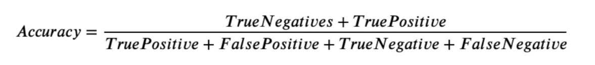
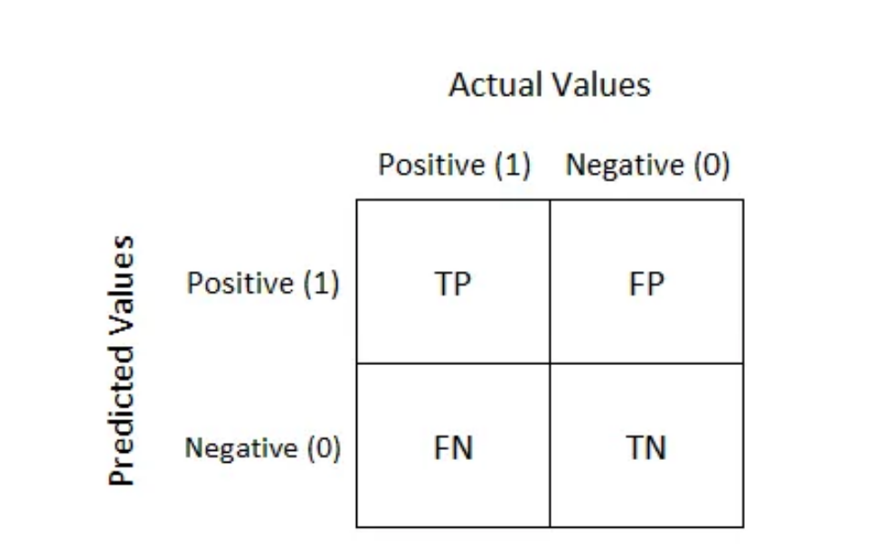
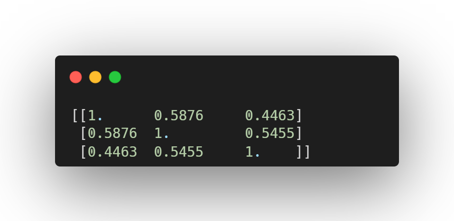

Benchmarking and Evaluation
=======================

Metrics for Evaluating The LLM-Powered Chatbot
------------------------------

Evaluating the performance of LLM-powered chatbots is crucial in understanding how effectively they interact with users and achieve their intended functions. Given the complexity of natural language and the nuances of human communication, several metrics are employed to measure a chatbot's proficiency from various angles. 

1. Accuracy
**********

The concept of accuracy within the context of LLM-powered chatbots encompasses several layers and is pivotal in assessing the overall effectiveness of these systems in understanding and responding to user inputs. At its core, accuracy measures the chatbot's ability to produce responses that are both correct and relevant to the user's query or statement.

What is Confusion Matrix and why you need it?

Well, it is a performance measurement for machine learning classification problem where output can be two or more classes. It is a table with 4 different combinations of predicted and actual values.

.. figure:: ../Images/truefalse.png
   :width: 80%
   :alt: Alternative text for the image
   :align: center   

2. Intent Recognition Accuracy
*********************
 Specifically gauges how accurately the chatbot identifies the users' intentions. This is critical for routing the conversation correctly and providing the appropriate responses or actions.

3. Fallback
*************

A fallback is an alternative plan that may be used in an emergency

Crucially, fallbacks can be applied not only on the LLM level but on the whole runnable level. This is important because often times different models require different prompts. So if your call to OpenAI fails, you don’t just want to send the same prompt to Anthropic - you probably want to use a different prompt template and send a different version there.
There are different types of fallbacks:

+Fallback for LLM API Errors:

This is maybe the most common use case for fallbacks. A request to an LLM API can fail for a variety of reasons - the API could be down, you could have hit rate limits, any number of things. Therefore, using fallbacks can help protect against these types of things.

+Fallback for Sequences

We can also create fallbacks for sequences, that are sequences themselves. Here we do that with two different models: ChatOpenAI and then normal OpenAI (which does not use a chat model). Because OpenAI is NOT a chat model, you likely want a different prompt.

+Fallback for Long Inputs

One of the big limiting factors of LLMs is their context window. Usually, you can count and track the length of prompts before sending them to an LLM, but in situations where that is hard/complicated, you can fallback to a model with a longer context length..

4. Task Completion Rate
**********

The percentage of conversations where the chatbot successfully completes the intended task or resolves the user's issue without escalation. High rates indicate effectiveness in autonomous problem solving.

5. Engagement Rate
****************
Reflects how well the chatbot maintains users' interest or participation over time. Metrics could include the number of conversation turns, session duration, or repeat interactions.

6. Response Time
************
The average time taken by the chatbot to respond to user inputs. Faster response times are typically associated with better user experiences but must also balance the need for accurate and thoughtful responses.

`Hands on for Evaluation Metrics`_

.. _Hands on for Evaluation Metrics: https://colab.research.google.com/drive/1UGrTp6g64OEzD0a27X7D8HhqwZc--hN_?usp=sharing

Benchmarking LLM Performance
----------------------
Do's and dont's section
*********
The following table outlines essential do's and dont's for effective benchmarking in AI:

.. list-table::
   :widths: 50 50
   :header-rows: 1

   * - Do's
     - Don'ts
   * - Utilize diverse and representative datasets for evaluation
     - Rely solely on synthetic or biased datasets
   * - Ensure transparency and fairness in the benchmarking process
     - Overlook the influence of biases and confounding factors in evaluations
   * - Implement standardized evaluation methodologies and metrics
     - Neglect the continuous assessment and re-evaluation of benchmarking practices
   * - Consider the impact of contextual factors in performance assessments
     - Overemphasize single-point performance metrics without holistic consideration

1. Comparison with Baselines
****************

When introducing a new LLM, it’s essential to compare its performance against established baselines. These baselines are typically previous models or well-known standards in the industry that represent the minimum expected performance. To make this comparison:

+ Identify standard tasks that the LLM should perform (e.g., text classification, question answering).

+ Use the same datasets and metrics that were used to evaluate the baseline models to ensure comparability.

+ Run the LLM on these tasks and compare the outcomes with the results from the baseline models.

+ Report improvements or regressions in performance, providing a clear picture of where the new LLM stands.

2. Task-Specific Benchmarks
******************

Task-specific benchmarks involve evaluating the LLM’s performance on a variety of tasks that are representative of its expected usage. This might include:

- NLP tasks such as sentiment analysis, named entity recognition, or language translation.

- Specialized tasks that are relevant to the domain where the LLM will be applied, such as industrial applications.

- Standardized benchmarks such as GLUE or SuperGLUE that aggregate multiple NLP tasks to provide a comprehensive assessment.

- Performance is then quantified using appropriate metrics like accuracy, F1 score, BLEU score for translation, or ROUGE for summarization.

3. LLM’s efficiency in resource utilization
**************

Efficiency in resource utilization assesses how well the LLM uses computational resources relative to the performance it achieves. This aspect is increasingly important due to the large environmental and economic costs of training and running LLMs(Look at The computational requirements for Training LLMs section for more details).

Similarity Search
--------------------

Similarity Search as a Validation Tool for Fine-Tuning Pretrained LLMs
~~~~~~~~~~~~~~~~~~~~~~~~~~~~~~~~~~~~~~~~~~~~~~~~~~~~~~~~~~~~~~~~~~~~~~~~~~~

Similarity search is a powerful method for comparing the outputs of pretrained language models (LLMs) and fine-tuned LLMs. By measuring how similar the outputs are, we can assess the effectiveness of the fine-tuning process. This approach is beneficial because it quantifies the changes and improvements in the model's performance, ensuring that the fine-tuned model aligns more closely with the desired output.

Semantic Similarity in Similarity Search
**********************************
Semantic similarity measures how closely the meanings of two pieces of text align. In the context of comparing LLM outputs, semantic similarity search can reveal whether the fine-tuned model produces responses that are semantically closer to the intended outcomes than the pretrained model.

Semantic Similarity Search is a technique used to compare pieces of text to identify those with similar meanings. This process, although straightforward for humans, is complex for machines due to the intricacies of language. To address this, researchers in Natural Language Processing (NLP) have developed methods to convert unstructured text data into formats that Machine Learning models can understand.

One of the most effective methods is using vector embeddings. Vector embeddings are numerical representations of text that capture its semantic meaning in a way that is computationally efficient.

Cosine Similarity
****************
Cosine Similarity is a metric used to measure how similar two vectors are by calculating the cosine of the angle between them. This is particularly useful for high-dimensional spaces like word embeddings or sentence embeddings, where the magnitude of the vectors is less important than their direction.

**Formula:** The cosine similarity between two vectors A and B is calculated as:

.. figure:: ../Images/cosin.png
   :width: 80%
   :alt: Alternative text for the image
   :align: center

**Interpretation:** A cosine similarity value of 1 indicates that the vectors are identical, 0 indicates orthogonality (no similarity), and -1 indicates complete dissimilarity.

For example, consider the following sentences:

The cat is sitting on the mat.

The orange cat is sitting on the mat.

The dog is sitting on the floor.

Today is a good day.

.. figure:: ../Images/simpic.png
   :width: 80%
   :alt: Alternative text for the image
   :align: center

Here, we can see the cosine similarity search method identifying similarities (and their lack-of) between texts ,and return as an output ,the cosine of the angle between the vector embeddings of each text.

BLEU Score
*********
BLEU (Bilingual Evaluation Understudy) is a metric for evaluating the quality of text generated by a machine learning model, particularly in translation tasks. It measures how many words or phrases in the generated text match the reference text.

**Formula:** BLEU is calculated based on the precision of n-grams (contiguous sequences of n items from the text). The BLEU score is the geometric mean of the n-gram precisions, multiplied by a brevity penalty to penalize overly short translations.

**Interpretation** BLEU scores range from 0 to 1, with higher scores indicating closer matches to the reference text. A score of 1 means a perfect match.

METEOR Score
*************
METEOR (Metric for Evaluation of Translation with Explicit ORdering) is another metric for evaluating machine translation quality. It addresses some limitations of BLEU by incorporating synonyms, stemming, and a more flexible matching strategy.

**Formula:** METEOR aligns the generated text with the reference text based on exact matches, stem matches, synonym matches, and paraphrase matches. It then calculates precision, recall, and a harmonic mean, adjusting for factors like word order.

**Interpretation:** METEOR scores range from 0 to 1, with higher scores indicating better alignment with the reference text. The score considers both precision and recall, providing a more holistic view of the similarity.

Using Similarity Metrics to Validate Fine-Tuning
---------------------------------------------

Compare the scores from the pretrained and fine-tuned models. Significant improvements in these metrics indicate that the fine-tuning process has enhanced the model's ability to generate semantically similar and high-quality text.
( In the cosine method we have also added a comparaison with the reference text from the training dataset )

.. code-block:: python

    from sklearn.feature_extraction.text import CountVectorizer
    import pandas as pd
    from sklearn.metrics.pairwise import cosine_similarity

    dataset_output = "To calibrate a pressure gauge, first ensure the gauge is disconnected from any pressure source. Connect the gauge to a known, accurate pressure source or a calibrator. Apply pressure in increments and compare the gauge reading with the known pressure. Adjust the gauge calibration screw to correct any discrepancies. Repeat the process to ensure accuracy. Document the calibration in the maintenance log."

    input_sentences = tokenizer("How to calibrate a pressure gauge?", return_tensors="pt").to('cuda')

    # Generate output using the original pretrained model
    foundational_outputs_sentence = get_outputs(loaded_model, input_sentences, max_new_tokens=50)
    pretrained_output = tokenizer.batch_decode(foundational_outputs_sentence, skip_special_tokens=True)[0]

    # Generate output using the finetuned model
    foundational_outputs_sentence_finetuned = get_outputs(foundation_model, input_sentences, max_new_tokens=50)
    finetuned_output = tokenizer.batch_decode(foundational_outputs_sentence_finetuned, skip_special_tokens=True)[0]

    # Prepare the documents for vectorization
    documents = [pretrained_output, finetuned_output,dataset_output]

    # Initialize the CountVectorizer
    count_vectorizer = CountVectorizer(stop_words="english")
    sparse_matrix = count_vectorizer.fit_transform(documents)

    # Convert the sparse matrix to a dense matrix
    doc_term_matrix = sparse_matrix.todense()

    # Create a DataFrame from the dense matrix
    df = pd.DataFrame(
       doc_term_matrix,
       columns=count_vectorizer.get_feature_names_out(),
       index=["pretrained_output", "finetuned_output","dataset_output"]
    )

    # Print the DataFrame
    print("pretrained_output"+ pretrained_output +"\n"  , "finetuned_output" + finetuned_output +"\n" ,"dataset_output"+ dataset_output)

    # Calculate and print the cosine similarity
    cosine_sim = cosine_similarity(df, df)
    print(cosine_sim)

The output is as follows:

The cosine similarity matrix indicates the following:

+ pretrained_output vs. finetuned_output: Cosine similarity is 0.5876, indicating moderate similarity between outputs from the pretrained model and the finetuned model.

+ pretrained_output vs.dataset_output: Cosine similarity is 0.4463, suggesting a lower similarity between outputs from the pretrained model and the dataset answers.

+ finetuned_output vs. dataset_output: Cosine similarity is 0.5455, showing moderate similarity between outputs from the finetuned model and the dataset answers.

These results suggest that the fine-tuned LLM has diverged significantly from both the pretrained LLM and the dataset answer, indicating that the fine-tuning process has not aligned the model closely with the expected dataset answers. Further refinement may be needed to improve alignment.

In practice, human evaluation plays a crucial role in assessing the quality of the model's outputs. Humans can judge nuances, context, and appropriateness of responses in ways that metrics cannot fully capture. 

This highlights the necessity of combining human evaluation with quantitative metrics to ensure a comprehensive assessment of the fine-tuning process. Human evaluators can provide insights into the correctness, relevance, and coherence of the generated text, ensuring that the fine-tuned model truly meets the desired standards.
