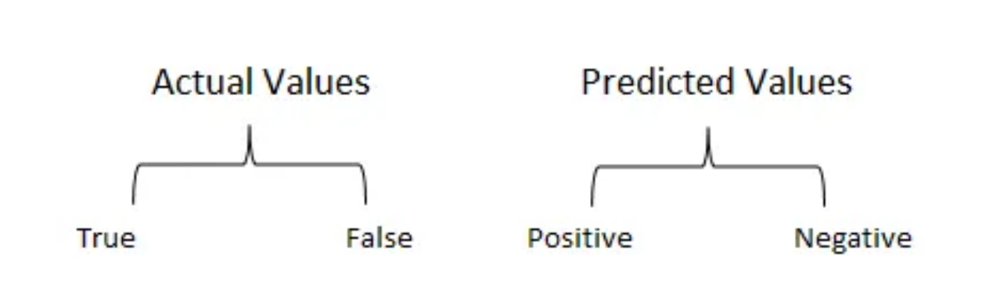

Benchmarking and Evaluation
=======================

Metrics for Evaluating The LLM-Powered Chatbot
------------------------------

Evaluating the performance of LLM-powered chatbots is crucial in understanding how effectively they interact with users and achieve their intended functions. Given the complexity of natural language and the nuances of human communication, several metrics are employed to measure a chatbot's proficiency from various angles. 

1. Accuracy
**********

The concept of accuracy within the context of LLM-powered chatbots encompasses several layers and is pivotal in assessing the overall effectiveness of these systems in understanding and responding to user inputs. At its core, accuracy measures the chatbot's ability to produce responses that are both correct and relevant to the user's query or statement.

What is Confusion Matrix and why you need it?

Well, it is a performance measurement for machine learning classification problem where output can be two or more classes. It is a table with 4 different combinations of predicted and actual values.

2. Intent Recognition Accuracy
*********************
 Specifically gauges how accurately the chatbot identifies the users' intentions. This is critical for routing the conversation correctly and providing the appropriate responses or actions.

3. Fallback
*************

A fallback is an alternative plan that may be used in an emergency

Crucially, fallbacks can be applied not only on the LLM level but on the whole runnable level. This is important because often times different models require different prompts. So if your call to OpenAI fails, you don’t just want to send the same prompt to Anthropic - you probably want to use a different prompt template and send a different version there.
There are different types of fallbacks:

+Fallback for LLM API Errors:

This is maybe the most common use case for fallbacks. A request to an LLM API can fail for a variety of reasons - the API could be down, you could have hit rate limits, any number of things. Therefore, using fallbacks can help protect against these types of things.

+Fallback for Sequences

We can also create fallbacks for sequences, that are sequences themselves. Here we do that with two different models: ChatOpenAI and then normal OpenAI (which does not use a chat model). Because OpenAI is NOT a chat model, you likely want a different prompt.

+Fallback for Long Inputs

One of the big limiting factors of LLMs is their context window. Usually, you can count and track the length of prompts before sending them to an LLM, but in situations where that is hard/complicated, you can fallback to a model with a longer context length..

4. Task Completion Rate
**********

The percentage of conversations where the chatbot successfully completes the intended task or resolves the user's issue without escalation. High rates indicate effectiveness in autonomous problem solving.

5. Engagement Rate
****************
Reflects how well the chatbot maintains users' interest or participation over time. Metrics could include the number of conversation turns, session duration, or repeat interactions.

6. Response Time
************
The average time taken by the chatbot to respond to user inputs. Faster response times are typically associated with better user experiences but must also balance the need for accurate and thoughtful responses.

Benchmarking LLM Performance
----------------------

1. Comparison with Baselines
****************

When introducing a new LLM, it’s essential to compare its performance against established baselines. These baselines are typically previous models or well-known standards in the industry that represent the minimum expected performance. To make this comparison:

+ Identify standard tasks that the LLM should perform (e.g., text classification, question answering).

+ Use the same datasets and metrics that were used to evaluate the baseline models to ensure comparability.

+ Run the LLM on these tasks and compare the outcomes with the results from the baseline models.

+ Report improvements or regressions in performance, providing a clear picture of where the new LLM stands.

2. Task-Specific Benchmarks
******************

Task-specific benchmarks involve evaluating the LLM’s performance on a variety of tasks that are representative of its expected usage. This might include:

- NLP tasks such as sentiment analysis, named entity recognition, or language translation.

- Specialized tasks that are relevant to the domain where the LLM will be applied, such as industrial applications.

- Standardized benchmarks such as GLUE or SuperGLUE that aggregate multiple NLP tasks to provide a comprehensive assessment.

- Performance is then quantified using appropriate metrics like accuracy, F1 score, BLEU score for translation, or ROUGE for summarization.

3. LLM’s efficiency in resource utilization
**************

Efficiency in resource utilization assesses how well the LLM uses computational resources relative to the performance it achieves. This aspect is increasingly important due to the large environmental and economic costs of training and running LLMs(Look at The computational requirements for Training LLMs section for more details).
