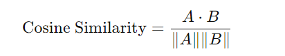
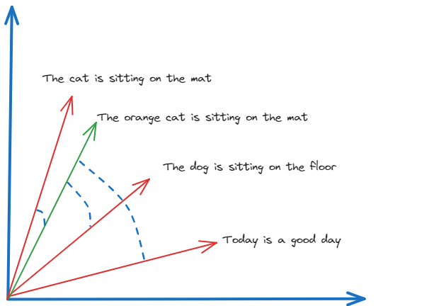

Similarity Search
=======================

Similarity Search as a Validation Tool for Fine-Tuning Pretrained LLMs
------------------------------

Similarity search is a powerful method for comparing the outputs of pretrained language models (LLMs) and fine-tuned LLMs. By measuring how similar the outputs are, we can assess the effectiveness of the fine-tuning process. This approach is beneficial because it quantifies the changes and improvements in the model's performance, ensuring that the fine-tuned model aligns more closely with the desired output.

Semantic Similarity in Similarity Search
**********************************
Semantic similarity measures how closely the meanings of two pieces of text align. In the context of comparing LLM outputs, semantic similarity search can reveal whether the fine-tuned model produces responses that are semantically closer to the intended outcomes than the pretrained model.

Semantic Similarity Search is a technique used to compare pieces of text to identify those with similar meanings. This process, although straightforward for humans, is complex for machines due to the intricacies of language. To address this, researchers in Natural Language Processing (NLP) have developed methods to convert unstructured text data into formats that Machine Learning models can understand.

One of the most effective methods is using vector embeddings. Vector embeddings are numerical representations of text that capture its semantic meaning in a way that is computationally efficient.

Cosine Similarity
****************
Cosine Similarity is a metric used to measure how similar two vectors are by calculating the cosine of the angle between them. This is particularly useful for high-dimensional spaces like word embeddings or sentence embeddings, where the magnitude of the vectors is less important than their direction.

**Formula:** The cosine similarity between two vectors A and B is calculated as:

**Interpretation:** A cosine similarity value of 1 indicates that the vectors are identical, 0 indicates orthogonality (no similarity), and -1 indicates complete dissimilarity.

For example, consider the following sentences:

The cat is sitting on the mat.

The orange cat is sitting on the mat.

The dog is sitting on the floor.

Today is a good day.

Here we can see the cosine similarity search method identifies similarities (and their lack) between texts and return as an output the cosine of the angle between the vector embeddings of each text.

BLEU Score
*********
BLEU (Bilingual Evaluation Understudy) is a metric for evaluating the quality of text generated by a machine learning model, particularly in translation tasks. It measures how many words or phrases in the generated text match the reference text.

**Formula:** BLEU is calculated based on the precision of n-grams (contiguous sequences of n items from the text). The BLEU score is the geometric mean of the n-gram precisions, multiplied by a brevity penalty to penalize overly short translations.

**Interpretation** BLEU scores range from 0 to 1, with higher scores indicating closer matches to the reference text. A score of 1 means a perfect match.

METEOR Score
*************
METEOR (Metric for Evaluation of Translation with Explicit ORdering) is another metric for evaluating machine translation quality. It addresses some limitations of BLEU by incorporating synonyms, stemming, and a more flexible matching strategy.

**Formula:** METEOR aligns the generated text with the reference text based on exact matches, stem matches, synonym matches, and paraphrase matches. It then calculates precision, recall, and a harmonic mean, adjusting for factors like word order.

**Interpretation:** METEOR scores range from 0 to 1, with higher scores indicating better alignment with the reference text. The score considers both precision and recall, providing a more holistic view of the similarity.

Using Similarity Metrics to Validate Fine-Tuning
---------------------------------------------

Compare the scores from the pretrained and fine-tuned models. Significant improvements in these metrics indicate that the fine-tuning process has enhanced the model's ability to generate semantically similar and high-quality text.
( In the cosine method we have also added a comparaison with the reference text from the training dataset )

.. code-block:: python

    from sklearn.feature_extraction.text import CountVectorizer
    import pandas as pd
    from sklearn.metrics.pairwise import cosine_similarity

    dataset_output = "The torque specification is 450 ft-lbs"

    input_sentences = tokenizer("What are the torque specifications for the wheel nuts on the 988H?", return_tensors="pt").to('cuda')

    # Generate output using the original pretrained model
    foundational_outputs_sentence = get_outputs(loaded_model, input_sentences, max_new_tokens=50)
    pretrained_output = tokenizer.batch_decode(foundational_outputs_sentence, skip_special_tokens=True)[0]

    # Generate output using the finetuned model
    foundational_outputs_sentence_finetuned = get_outputs(foundation_model, input_sentences, max_new_tokens=50)
    finetuned_output = tokenizer.batch_decode(foundational_outputs_sentence_finetuned, skip_special_tokens=True)[0]

    # Prepare the documents for vectorization
    documents = [pretrained_output, finetuned_output,dataset_output]

    # Initialize the CountVectorizer
    count_vectorizer = CountVectorizer(stop_words="english")
    sparse_matrix = count_vectorizer.fit_transform(documents)

    # Convert the sparse matrix to a dense matrix
    doc_term_matrix = sparse_matrix.todense()

    # Create a DataFrame from the dense matrix
    df = pd.DataFrame(
       doc_term_matrix,
       columns=count_vectorizer.get_feature_names_out(),
       index=["pretrained_output", "finetuned_output","dataset_output"]
    )

    # Print the DataFrame
    print("pretrained_output"+ pretrained_output +"\n"  , "finetuned_output" + finetuned_output +"\n" ,"dataset_output"+ dataset_output)

    # Calculate and print the cosine similarity
    cosine_sim = cosine_similarity(df, df)
    print(cosine_sim)

