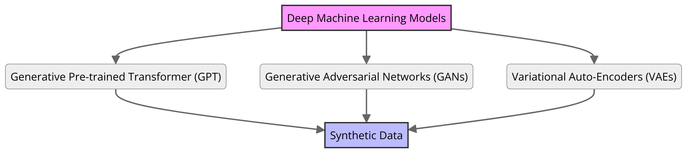

Synthetic data generation for industrial applications
===============

Synthetic data is a form of data that mimics the real-world patterns generated through machine learning algorithms.

Importance of synthetic data
----------

Synthetic data is very important for industrial uses because of several key reasons:
Here is a mindmap diagram illustrating the importance of data synthesis for industrial 
applications, specifically for fine-tuning Large Language Models (LLMs):

.. .. figure:: ../Images/diagram_data_synt_import.png
..    :width: 80%
..    :align: center
..    :alt: Alternative text for the image

1. Overcoming Data Scarcity
^^^^^^^^^^^^^^^^^^^^^^^^^^^^

Data synthesis helps generate diverse datasets where real-world data is limited or hard to collect. 
For example, in industries such as healthcare, synthetic patient data can be created to train models
without compromising privacy. This approach allows for a more comprehensive dataset that models can
learn from, enhancing their ability to generalize across different scenarios.

2. Improving Model Robustness
^^^^^^^^^^^^^^^^^^^^

Data synthesis can help reduce model bias and increase its generalization capabilities, By generating 
synthetic data that covers rare or underrepresented scenarios.
For Example, in autonomous vehicle development, synthetic data can simulate rare driving conditions 
(like extreme weather which real-data is more rare) to ensure the model performs well in a variety of situations, thus improving safety 
and reliability.

3. Accelerating Development
^^^^^^^^^^^^^^^^^^^^

Data synthesis can significantly speed up the development cycle of LLMs by reducing the time and costs 
associated with data collection and labeling. For example, for companies developing natural language 
processing (NLP) applications, synthetic data can quickly provide the diverse linguistic input needed 
for training, enabling faster iteration and deployment of models.

4. Data Protection and Privacy: 
^^^^^^^^^^^

By generating synthetic datasets that exclude personally identifiable information and sensitive data, user privacy is effectively safeguarded. These datasets can be used for research and development purposes. 

5. Data Augmentation:
^^^^^^^^^^^

Moreover, generative models provide the advantage of generating novel training data that can significantly improve real-world datasets. This method is especially beneficial when obtaining more real data is expensive or time-consuming.

6. Data Availability and Accessibility: 
^^^^^^

In situations where access to authentic data is constrained or inadequate, generative models offer a viable solution, enabling researchers and developers to manipulate data representations for their research or applications.
 
.. Attention:: When creating and utilizing synthetic data, it's essential to be mindful of its accuracy, potential biases, privacy concerns, the risk of overfitting, the expenses involved, and adherence to legal standards.  

Techniques for generating synthetic data
---------------

Now that we discussed the importance of generating synthetic datasets, We will introduce multiple techniques to generate synthetic data, out of which these are the most prominent:

Drawing Numbers from a Distribution
--------------------------------------------

Sampling from a distribution is a widely used method in synthetic data generation, where numbers are selected from a statistical distribution to mimic real-world data patterns. Using Python and the NumPy library, one can easily generate datasets that adhere to a specified distribution, such as a normal distribution.
An example of this is generating a dataset with values normally distributed around a mean of 0 and a standard deviation of 1.

.. code-block:: python 
   import numpy as np
   import matplotlib.pyplot as plt

   #Generate synthetic data
   data = np.random.normal(loc=0, scale=1, size=1000)
   # Visualize the distribution
   plt.hist(data, bins=30)
   plt.title('Synthetic Data with Normal Distribution')
   plt.xlabel('Value')
   plt.ylabel('Frequency')
   plt.show()

    
Agent-based Modeling (ABM):
--------------

Agent-based modeling is a simulation technique where individual agents interact with each other in a complex system. ABM is useful for examining interactions between agents such as people, cells, or computer programs. Python packages such as Mesa can quickly create agent-based models using built-in core components and visualize them in a browser-based interface.
For example simulating predator-prey dynamics in an ecosystem.

.. Note:: 
      Using effective prompt strategies can steer the model to produce better, consistent, and more factual responses.

Prompts:
--------

Prompt:: Produce 10 exemplars for sentiment analysis. Examples are categorized as either positive or negative. Produce 2 negative examples and 8 positive examples. Use this format for the examples: Q: <sentence> A: <sentiment>

Output:: 
   - Q: I just got the best news ever! A: Positive
   - Q: We just got a raise at work! A: Positive
   - Q: I'm so proud of what I accomplished today. A: Positive
   - Q: I'm having the best day ever! A: Positive
   - Q: I'm really looking forward to the weekend. A: Positive
   - Q: I just got the best present ever! A: Positive
   - Q: I'm so happy right now. A: Positive
   - Q: I'm so blessed to have such an amazing family. A: Positive
   - Q: The weather outside is so gloomy. A: Negative
   - Q: I just got some terrible news. A: Negative

This is very useful. We actually use this example for a different test in another section of the guides.

.. note:: 
   In our case, we generated synthetic data from GPT-4, by the use of the following prompt:

   Prompt:: 
      **Instruction**: As an industrial engineer with extensive expertise in your field, your task is to generate a synthetic dataset that accurately reflects the complexities and nuances of industrial engineering.
      
      **Input**: generate synthetic data about production to be near factual, generate real industrial situations.
      
      **Output**: Json file <input, context, output> and the number of questions is 500.
   
   The output was our json file containing synthetic data.

