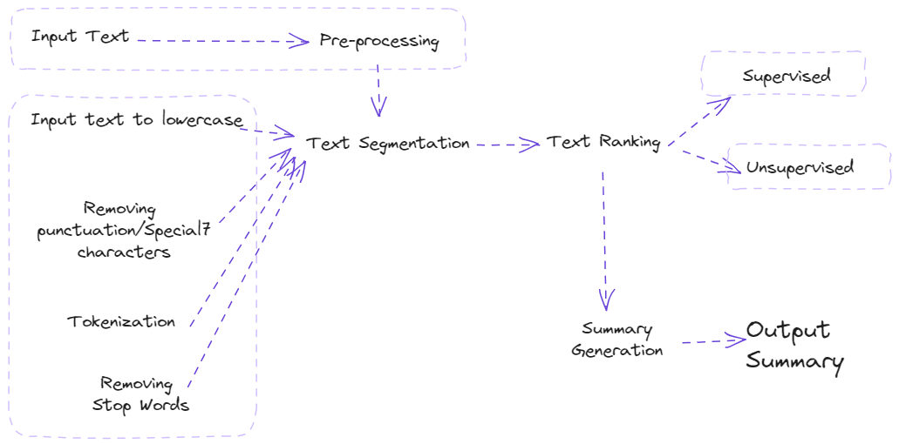

Text Generation and Summarization
---------------------------------

Text Summarization Techniques ( extractive and abstractive summarization methods enabled by LLMs)
^^^^^^^^^^^^^^^^^^^^^^^^^^^^^^^^^^^^^

Text generation and summarization are two advanced applications of natural language processing (NLP) that leverage artificial intelligence to manipulate language data.

Text generation involves creating coherent and contextually relevant text based on input data. This AI-driven process can produce content ranging from chatbot responses to full-length articles, emulating human-like writing styles.

Text summarization, on the other hand, aims to condense a larger body of text into a concise summary, preserving the original message and critical information.

.. figure:: ../Images/texttotext.png
   :width: 80%
   :alt: Alternative text for the image
   :align: center

   Flowchart explaining Extractive VS Abstractive Summarization

Extractive Summarization
^^^^^^^^^^^^^^^^^^^^^^^^

Extractive Summarization simply takes out the important sentences or phrases from the original text and joins them to form a summary.

A ranking algorithm is used, which assigns scores to each of the sentences in the text based on their relevance to the overall meaning of the document. The most relevant sentences are then chosen to be included in the summary.

   Flowchart explaining Extractive Summarization

There are various ways through which the ranking of sentences can be performed.
 -TF-IDF (term frequency-inverse document frequency)
 -Graph-based methods such as TextRank
 -Machine learning-based methods such as Support Vector Machines (SVM)
and Random Forests.

Example:Extractive Summarization

Objective: Utilizing a pre-trained Large Language Model known as bert for
text summarization.

`Hands on for Extractive Summarization`_.

.. _Hands on for Extractive Summarization: https://colab.research.google.com/drive/1pUVjSR3izak6yhVH0ohC1MGMBnmpfT3-#scrollTo=v864N5gCt06T

Abstractive Summarization
^^^^^^^^^^^^^^^^^^^^^^^^

The abstractive summarization method is an outline/summary or the basic idea
of a voluminous thing(text).

It analyses the input text and generates new phrases
or sentences that capture the essence of the original text and convey the same
meaning as the original text but more concisely.

The input text is analyzed by a neural network model that learns to generate
new phrases and sentences that capture the essence of the original text.

Example:Abstractive Summarization

Objective: Using the Hugging Face Transformers library in Python to perform abstractive summarization on a piece of text.

`Hands on for EAbstactive Summarization`_.

.. _Hands on for Abstractive Summarization: https://colab.research.google.com/drive/1HLyGPjFfAHGt-XFTU0DSt1Gpiz4bbTtW#scrollTo=LMkQR7V1dn1V