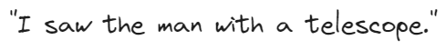

Text Generation and Summarization
---------------------------------

Text Summarization Techniques ( extractive and abstractive summarization methods enabled by LLMs)
^^^^^^^^^^^^^^^^^^^^^^^^^^^^^^^^^^^^^

Text generation and summarization are two advanced applications of natural language processing (NLP) that leverage artificial intelligence to manipulate language data.

Text generation involves creating coherent and contextually relevant text based on input data. This AI-driven process can produce content ranging from chatbot responses to full-length articles, emulating human-like writing styles.

Text summarization, on the other hand, aims to condense a larger body of text into a concise summary, preserving the original message and critical information.

.. figure:: ../Images/textotext.png
   :width: 80%
   :alt: Alternative text for the image
   :align: center

   Flowchart explaining Extractive VS Abstractive Summarization

Extractive Summarization
^^^^^^^^^^^^^^^^^^^^^^^^

Extractive Summarization simply takes out the important sentences or phrases from the original text and joins them to form a summary.

A ranking algorithm is used, which assigns scores to each of the sentences in the text based on their relevance to the overall meaning of the document. The most relevant sentences are then chosen to be included in the summary.

.. figure:: ../Images/textSUM.png
   :width: 80%
   :alt: Alternative text for the image
   :align: center

   Flowchart explaining Extractive Summarization

There are various ways through which the ranking of sentences can be performed.
 -TF-IDF (term frequency-inverse document frequency)
 -Graph-based methods such as TextRank
 -Machine learning-based methods such as Support Vector Machines (SVM)
and Random Forests.

Example:Extractive Summarization

Objective: Utilizing a pre-trained Large Language Model known as bert for
text summarization.

`Hands on for Extractive Summarization`_.

.. _Hands on for Extractive Summarization: https://colab.research.google.com/drive/1pUVjSR3izak6yhVH0ohC1MGMBnmpfT3-#scrollTo=v864N5gCt06T

Abstractive Summarization
^^^^^^^^^^^^^^^^^^^^^^^^

The abstractive summarization method is an outline/summary or the basic idea
of a voluminous thing(text).

It analyses the input text and generates new phrases
or sentences that capture the essence of the original text and convey the same
meaning as the original text but more concisely.

The input text is analyzed by a neural network model that learns to generate
new phrases and sentences that capture the essence of the original text.

Example:Abstractive Summarization

Objective: Using the Hugging Face Transformers library in Python to perform abstractive summarization on a piece of text.

`Hands on for EAbstactive Summarization`_.

.. _Hands on for Abstractive Summarization: https://colab.research.google.com/drive/1HLyGPjFfAHGt-XFTU0DSt1Gpiz4bbTtW#scrollTo=LMkQR7V1dn1V

LLMs relevance in context-aware Text Generation
--------------------------

Large Language Models (LLMs) are important in generating context-aware text, as they excel in understanding and predicting language patterns based on extensive training data. These models can produce text that is not only grammatically correct but also contextually appropriate. 

Applications such as conversational AI, personalized content creation, and context-sensitive translations show this clearly.

Imagine you are using a digital assistant to draft an email, and you type the beginning of a sentence:

"Please find attached the..."

An LLM, utilizing its context-aware capabilities, would predict the next part of the sentence based on the context it has learned from training on vast amounts of text data. It might suggest completing the sentence with "report from our last meeting," "invoice for this month,"
or "document you requested," depending on the previous interactions, email content, or commonly recognized patterns.

To demonstrate the importance of context we will be looking at 
a classic example of a sentence that can be understood in two different ways:

This sentence can be interpreted in two distinct contexts:

1.Observation through an instrument: The speaker used a telescope to see the man. Here, the telescope is an instrument that aids in seeing something at a distance.

2.Observation of a man carrying an instrument: The man being observed is holding or carrying a telescope. In this interpretation, the focus is on what the man has with him.

Scenario 1:

Observation through an Instrument
Given the context that emphasizes the act of using the telescope for observation, an AI model might continue the sentence or paragraph with something related to the observations made, the stars, the moon, or distant objects seen through the telescope.

.. figure:: ../Images/ex1.png
   :width: 80%
   :alt: Alternative text for the image
   :align: center

Let's explore how an AI might handle each interpretation:

Scenario 2:

Observation of a Man Carrying an Instrument
If the context suggests that the focus is on a man who has a telescope, the AI might generate text that talks about the man's intentions, perhaps his plans for stargazing, or his physical appearance.

.. figure:: ../Images/ex2.png
   :width: 80%
   :alt: Alternative text for the image
   :align: center   

How AI Uses Context for Text Generation?
^^^^^^^^^^^^^^^^^

Preceding Text:
***********

The AI uses the sentences or paragraphs that come before the ambiguous sentence to gauge the topic and the direction of the narrative. Is the focus on astronomy, or is it on people and their actions?

Subsequent Text:
**************

If there's text following the ambiguous sentence, the AI can also use that information to retroactively understand the context better and align its continuations accordingly.

Training Data:
**********

The vast amount of text data on which these models are trained includes numerous examples of similar structures used in different contexts. This training helps the model predict the most likely continuation based on the probabilities learned from this data.

Prompt Design:
********

The way a prompt is structured can significantly influence the AI's interpretation. By explicitly mentioning the context or adding details leading up to the ambiguous sentence, one can guide the AI towards the intended meaning.