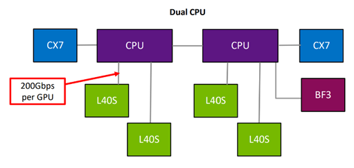
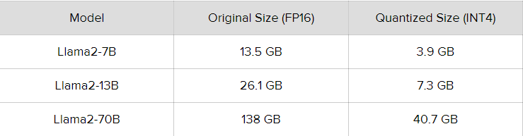

Computational Challenges in Training Large Language Models
=========================================================
The computational requirements for Training LLMs
-------------------------------------------------
Graphics Processing Unit (GPU)
~~~~~~~~~~~~~~~~~~~~~~~~~~~~~~~
GPUs are a cornerstone of LLM training due to their ability to accelerate parallel computations.
Modern deep learning frameworks, such as TensorFlow and PyTorch, leverage GPUs to perform matrix
multiplications and other operations required for neural network training. When selecting a GPU,
factors like memory capacity (VRAM), memory bandwidth, and processing power (measured in CUDA
cores) are crucial. High-end GPUs like NVIDIA’s Tesla series or the GeForce RTX series are commonly
favored for LLM training. The more powerful the GPU, the faster the training process, as an example
The L40S, offers excellent performance and efficiency at an affordable cost. Remember, as technology
evolves, newer and more powerful hardware will continue to emerge, so it is important to stay informed
and reassess your requirements periodically.

Central Processing Unit (CPU)
~~~~~~~~~~~~~~~~~~~~~~~~~~~~~~
While GPUs handle the bulk of neural network computations, CPUs still play a vital role in data
preprocessing, model setup, and coordination. A powerful multi-core CPU can significantly speed up
data loading, preprocessing, and model configuration tasks. However, for the actual training phase,
the GPU’s parallel processing capabilities take center stage.The two recommended CPU platforms are
Intel Xeon W and AMD Threadripper Pro.

random access memory(RAM)
~~~~~~~~~~~~~~~~~~~~~~~~~~
RAM is essential for efficiently handling large datasets and model parameters. During training, the
model’s architecture, gradients, and intermediate values are stored in memory. Therefore, a sufficient
amount of RAM is crucial to prevent memory-related bottlenecks. LLM training setups often require
tens or even hundreds of gigabytes of RAM. DDR4 or DDR5 RAM with high bandwidth and capacity
is recommended for handling substantial memory demands.

Storage
~~~~~~~~
Storage plays a crucial role in managing the vast amount of data involved in LLM training. Highcapacity, fast storage is required for storing raw text data, preprocessed data, and model checkpoints.
Solid State Drives (SSDs) are preferred over Hard Disk Drives (HDDs) due to their faster read and
write speeds. NVMe SSDs, in particular, offer exceptional performance and are well-suited for LLM
training workflows.

Networking
~~~~~~~~~~
Fast and stable internet connectivity is important for downloading datasets, sharing models, and
collaborating with colleagues. A reliable network connection ensures efficient data transfer and communication between distributed systems if you’re using a cluster setup.

Distributed Computing
~~~~~~~~~~~~~~~~~~~~~~
For training very large LLMs, a single GPU might not suffice. Distributed computing setups, where
multiple GPUs or even multiple machines collaborate on training, become essential. This requires
networking infrastructure, software frameworks (e.g., Horovod), and synchronization techniques to
ensure efficient parallel processing. An example of a recommended systeme configuration :

Existing Optimization techniques
--------------------------------
Model pruning
~~~~~~~~~~~~~
Model Pruning is a strategy used to simplify complex models by removing less important parameters
or weights. This technique is particularly useful in deep learning where models often have millions of
parameters, leading to high computational costs and memory requirements. By pruning these models,
data scientists can achieve similar performance with a smaller, more efficient model.
Model Pruning is crucial for several reasons:

 |1. Efficiency: Pruned models require less computational resources and memory, making them faster and more efficient to train and deploy.

 |2. Deployment: Pruned models are easier to deploy on devices with limited resources, such as mobile devices or embedded systems.

 |3. Overfitting: Pruning can help reduce overfitting by simplifying the model and reducing its capacity to memorize the training data.

Model Pruning works by identifying and removing the parameters that contribute least to the
model’s performance. There are several techniques for model pruning, including:

 |1. Weight Pruning: This technique removes the smallest weights in the model, the remaining weights are then retrained to compensate for the pruned weights.

 |2. Neuron Pruning: This technique removes entire neurons, along with their incoming and outgoing connections, the remaining neurons are then retrained.

 |3. Structured Pruning: This technique removes structured sets of parameters, such as entire layers or channels, this can lead to more efficient models, as the remaining structure can be more easily optimized by hardware accelerators.

In practice, model pruning often involves a trade-off between model size and performance. While
pruning can significantly reduce the size of a model, it can also lead to a decrease in performance.
Therefore, it’s important to carefully choose the pruning strategy and the amount of pruning to ensure
that the pruned model still meets the required performance criteria.
Model Pruning is widely used in the field of deep learning, especially in the deployment of models
on edge devices. For example, Google’s MobileNet architecture uses a form of structured pruning to
create efficient models for mobile devices.
In this lab example, we focus specifically on magnitude-based weight pruning, a technique that targets the removal of the smallest weights within a model. By selectively eliminating these less influential parameters and subsequently fine-tuning the remaining ones, we aim to demonstrate how this approach can effectively reduce model complexity while preserving performance levels. Through hands-on experimentation, participants will gain practical insights into the intricacies of weight pruning and its implications for model efficiency and deployment in resource-constrained environments.

.. button::
   :text: Hands on Lab
   :link: https://colab.research.google.com/drive/1ghXOWNWC8kmzKTDMm_YgBcOFkG3Jow_9?usp=drive_link

Quantization
~~~~~~~~~~~~
The term quantization referes to the process of mapping continuous infinite values to a smaller set of
discrete finite values. In the context of LLMs, it refers to the process of converting the weights of the
model from higher precision data types to lower-precision ones. Quantization significantly decreases the model’s size by reducing the number of bits required for each model weight. A typical scenario
would be the reduction of the weights from FP16 (16-bit Floating-point) to INT4 (4-bit Integer). This
allows for models to run on cheaper hardware and/or with higher speed. By reducing the precision of
the weights, the overall quality of the LLM can also suffer some impact.
Studies show that this impact varies depending on the techniques used and that larger models suffer
less from change in precision. Larger models (over 70B) are able to maintain their capacities even
when converted to 4-bit, with some techniques such as the NF4 suggesting no impact on their performance. Therefore, 4-bit appears to be the best compromise between performance and size/speed for
these larger models, while 6 or 8-bit might be better for smaller models

It’s possible to divide the techniques of obtaining quantized models into two:
   |1. Post-training quantization(PTQ): converting the weights of an already trained model to a lower precision without any retraining. Though straightforward and easy to implement, PTQ might degrade the model’s performance slightly due to the loss of precision in the value of the weights.
   |2.Quantization-Aware Training (QAT): Unlike PTQ, QAT integrates the weight conversion process during the training stage. This often results in superior model performance, but it’s more computationally demanding. A highly used QAT technique is the QLoRA.

Sometimes the quality of the answers might decrease when doing quantization on some smaller models
or a more aggressive type of quantization. In those cases before giving up on the quantized model,
a deep dive into prompt engineering might be the solution! Sometimes the model just needs to be
nudged in the right direction to still maintain the accuracy and quality.
In this lab, we're diving into something called 4-bit LLM Quantization with GPTQ. It's all about taking those fancy GPT models and squeezing them down to 4-bit precision. We'll be exploring how this process affects the size of the model, how well it performs, and whether it's practical for using on devices with limited resources. So, get ready to roll up your sleeves and delve into the nitty-gritty of quantizing GPT models!

.. button::
   :text: Hands on Lab
   :link: https://colab.research.google.com/drive/1g-D8rQlVZ-rMqSot3JZGd4MiQOzk-lUx?usp=sharing