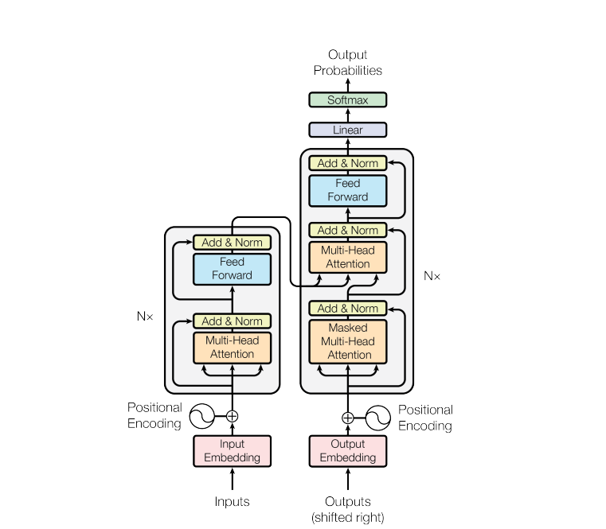
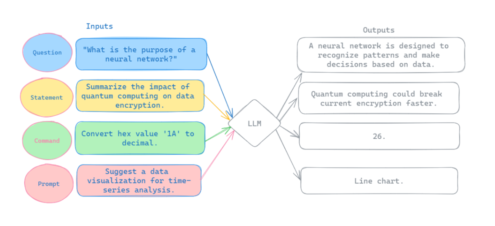
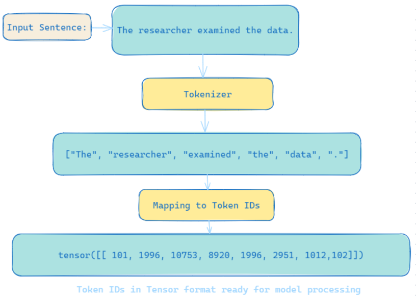
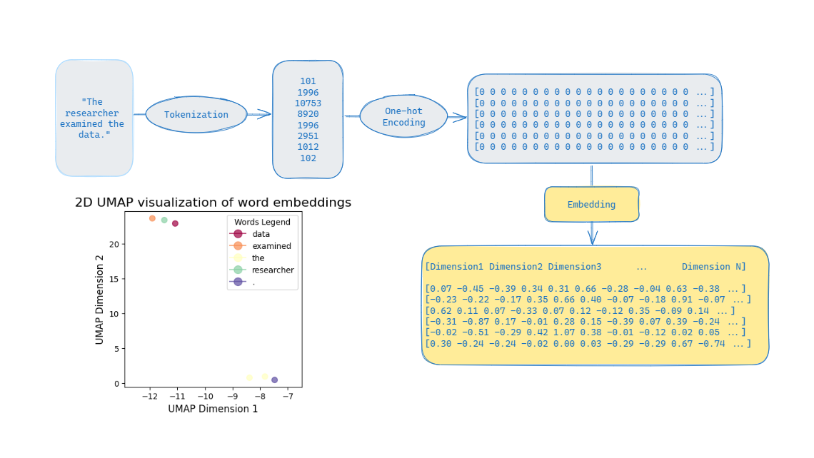

Transformers Overview
===================================
Introduction
------------------------------------
Transformers represent an advanced architecture of neural networks optimized for processing sequential data. This innovation was introduced by Vaswani et al. in the seminal paper `"Attention is All You Need" <https://arxiv.org/abs/1706.03762>`_ Central to its design is the self-attention mechanism, which enables the model to dynamically concentrate on various segments of the input sequence—irrespective of their initial positions. This capability is crucial for detecting and comprehending patterns and correlations that extend across extensive portions of the data.

   The Transformer architecture, as introduced in "Attention is All You Need."

The Components of Transformer Architecture
==========================================
Input Processing
------------------------------
Input
~~~~~~~~~~~~~~~~~~~~~~~~~~~~~~
In a Transformer model, the input is a sequence of words or tokens, commonly referred to as the context or prompt. 

Tokenization
~~~~~~~~~~~~~~~~~~~~~~~~~~~~~~~
Tokenization is the process of systematically decomposing input text into a se-
quence of tokens, which can include words, subwords, punctuation marks, and
individual characters. Each token is then mapped to a unique identifier, linking
it to a comprehensive and predefined vocabulary.
Note: The tokenizer used during training should be the same one used for
generating text.

   

`Hands On for Tokenization`_.

.. _Hands On for Tokenization: https://colab.research.google.com/drive/1SF_meHmrbrTq7oxVtXQ24GaO67pzjmHl

Embedding Layer
~~~~~~~~~~~~~~~~~~~~~~~~~~~~~~~

The embedding layer transforms the input tokens into dense, multidimensional
vector representations. It operates as a learnable embedding space,where each
unique token from the vocabulary is associated with a specific vector in a high-
dimensional space. This configuration allows the model to capture the semantic
meaning and contextual nuances of each token within the input sequence.

   From Words to Contextual Embeddings

`Hands On for words embeddings`_.

.. _Hands On for words embeddings:https://colab.research.google.com/drive/1ZLZ8UTUnAsJHeTW3sZw73XLDBvgJKqhY

Positional Encoding
~~~~~~~~~~~~~~~~~~~~~~~~~~~~~

Transformers do not inherently capture the order of tokens, To compensate for
this, positional encodings are integrated with the token embeddings, to provide information about each token’s location within the sequence. The original
Transformer paper proposed a specific method for positional encoding that uses
a combination of sine and cosine functions to generate a distinct encoding for
each position, although other methods can also be used.

`Hands on for Positional encoding`_.

.. _Hands on for Positional encoding:https://colab.research.google.com/drive/10vdBYhhd19sH3Vp5H5SiRpMykBMll_Je

Core Mechanisms
------------------------------

Self-Attention Layer
~~~~~~~~~~~~~~~~~~~~~~~~~~~~

The self-attention mechanism is a feature within neural networks that allows
the model to dynamically prioritize and interpret various segments of the in-
put sequence while ignoring physical distance. This functionality is achieved
through learned self-attention weights that are refined during the training pro-
cess. by adjusting these weights the model can capture implicit patterns and
dependencies.

`Hands on for Self-Attention Layer`_.

.. _Hands on for Self-Attention Layer:https://colab.research.google.com/drive/1fdr45ZpzuSXa0d3rgkxNrcRiCHMoJQO6#scrollTo=BobDOsxZnhY5

Multi-Head Attention
~~~~~~~~~~~~~~~~~~~~~~~~~~~~~~~

Multi-head attention expands the self-attention mechanism, allowing the model
to learn multiple sets of self-attention weights, or ”heads,” in parallel and in-
dependently. This design aims for the simultaneous comprehension of various
language facets, with the number of attention heads varying across models.
Each head captures different dimensions of the input sequence’s information.

`Hands on for Multi-Head Attention`_.

.. _Hands on for Multi-Head Attention:{https://colab.research.google.com/drive/1lRHUApEDwL77pG8mmObFovXX_yDSrt1W#scrollTo=Oe_QiFpYw4Mn
Network Layers
------------------------------

Feedforward Neural Network
~~~~~~~~~~~~~~~~~~~~~~~~~~~~~~~

The feedforward neural network in a Transformer model is a dense, fully-connected
layer that processes the output from the attention mechanisms. It further trans-
forms this output by applying a series of non-linear activations, refining the
attention-derived information into a vector of logits. These logits reflect the
model’s predictive confidence, with each logit proportional to the likelihood of
corresponding tokens in the tokenizer’s dictionary. To make sure that the model
not only identifies key patterns through attention but also evaluates and pre-
dicts the sequence’s structure and content accurately.

`Hands on for Feedforward Neural Network`_.

.. _Hands on for Feedforward Neural Network:https://colab.research.google.com/drive/1E70FTFNzPFhO44_FySWmMzZLEa-yI79G

Residual Connections
~~~~~~~~~~~~~~~~~~~~~~~~~~~~~~~~~

Residual connections or skip connections are used to add the input of each sub-
layer—be it self-attention or feedforward neural network- to its output prior to the application of layer normalization. this technique is important because it
allows the direct flow of gradients throughout the network, mitigating the van-
ishing gradient problem and enabling the training of deeper and more complex
models.
In simpler words:
Residual connections help the model preserve information from initial layers and
seamlessly integrating it with the knowledge gained in subsequent layers.

Layer Normalization
~~~~~~~~~~~~~~~~~~~~~~~~~~~~~~~~

Layer normalization is applied to the outputs of both the self-attention and
feedforward neural network layers, standardizing the outputs across features to
ensure a mean of zero and a standard deviation of one. This normalization
process aids in stabilizing the training of deep neural networks by mitigating
covariate shift, thereby facilitating faster convergence.

`Hands on for Residual Connections & Layer Normalization`_.

.. _Hands on for Residual Connections & Layer Normalization: https://colab.research.google.com/drive/1FqrBfqYe6ouMoWvC_zQaDIyEGsUO0xNR#scrollTo=nPt5jtl67eLQ
output Layer
~~~~~~~~~~~~~~~~~~~~~~~~~~~~~~~~

The final output is a probability distribution over the vocabulary, representing
the likelihood of each token being the next word in the sequence.This distribu-
tion is derived by channeling the output from the last Transformer block through
a linear layer, which is then processed by a softmax function. This sequence
of operations transforms the linear layer’s output into a comprehensive proba-
bility distribution, effectively predicting the next word in the sequence with a
quantifiable likelihood for each possible token.

`Full example here`_.

.. _full example here:https://colab.research.google.com/drive/1X4GlWya1NUkZlucbe6hc_y9_3u8Yzb5h#scrollTo=jpkEME0q9x5c
Types of Transformer Architectures
====================================

Encoder-Only Models
--------------------------

Overview
~~~~~~~~~~~~~~~~~~~~~~~~~

Encoder-only models or Auto-encoding Models are a class of Transformer-based
architectures designed primarily for understanding and interpreting text. Unlike
their encoder-decoder counterparts, they do not generate new text but focus on
analyzing and extracting meaning from input sequences.

.. table:: Examples of Existing Models
   :name: tab:roberta_bert

   +-------------------------------+---------------------------------------------+
   | Examples of Existing Models   | RoBERTa & BERT                              |
   +===============================+=============================================+
   | Focus                         | Understanding text                          |
   +-------------------------------+---------------------------------------------+
   | Applications                  | - Sentence embedding                        |
   |                               | - Sentiment Analysis                        |
   |                               | - Named entity recognition                  |
   |                               | - Text classification                       |
   |                               | - Feature extraction                        |
   +-------------------------------+---------------------------------------------+
   | Limitations                   | - Not designed for text generation          |
   |                               | - May require large datasets for fine-tuning|
   |                               | - Can be computationally intensive          |
   +-------------------------------+---------------------------------------------+

Masked Language Modeling in Encoder-Only Models
~~~~~~~~~~~~~~~~~~~~~~~~~~~~~~~~~~~~

Encoder-only models, such as BERT (Bidirectional Encoder Representations
from Transformers), use a training technique called ”masked language model-
ing” (MLM) to learn bidirectional representations of the input text.

Masking Tokens
^^^^^^^^^^^^^^^^^^^^

During the training phase, some tokens in the input sequence are randomly
selected and replaced with a special [MASK] token. The model’s task is to
predict these masked tokens based on the context provided by the surrounding
(unmasked) tokens.

Bidirectional Context
^^^^^^^^^^^^^^^^^^^^

Encoder-only models leverage the context from both directions (bidirectional),the
model considers both the preceding and following tokens to predict the masked
token.

Objective function
^^^^^^^^^^^^^^^^^^^^

The objective of the masked language modeling task is to minimize the pre-
diction error of the masked tokens. The model’s predictions are compared to
the actual tokens, and the parameters of the model are updated to reduce the
difference between the predicted and actual tokens.

Denoising
^^^^^^^^^^^^^^^^^^^^

The model performs a denoising task, where it attempts to reconstruct the
original sentence from a corrupted version (with masked tokens).

Decoder-Only Models
--------------------------

Overview
~~~~~~~~~~~~~~~~~~~~~~~

Decoder-only models or Auto-regressive models are a class of Transformer-based
architectures designed primarily for generating text. Unlike their encoder-
decoder counterparts, they focus solely on producing new text based on the
input sequence, often used in tasks like language modeling and text generation.

.. table:: Examples of Existing Models
   :name: tab:gpt_bloom

   +-------------------------------+------------------------------------------+
   | Examples of Existing Models   | GPT & BLOOM                              |
   +===============================+==========================================+
   | Focus                         | Text Generation                          |
   +-------------------------------+------------------------------------------+
   | Applications                  | - Text completion                        |
   |                               | - Language modeling                      |
   |                               | - Chatbots                               |
   |                               | - Text summarization                     |
   +-------------------------------+------------------------------------------+
   | Limitations                   | - May generate incoherent or biased text |
   |                               | - Requires substantial computational     |
   |                               |   resources                              |
   |                               | - Limited understanding of context       |
   |                               |   compared to encoder-decoder models     |
   +-------------------------------+------------------------------------------+

Causal Language Modeling in Decoder-Only Models
~~~~~~~~~~~~~~~~~~~~~~~~~~~~~~~~~~~~~

Decoder-only models, such as GPT (Generative Pretrained Transformer), use a
training technique called ”causal language modeling” (CLM) to learn sequential
representations of the input text.

Sequential Prediction
^^^^^^^^^^^^^^^^^^^^

During the training phase, the model predicts each token in the input sequence
based on the preceding tokens. Unlike masked language modeling, which pre-
dicts randomly masked tokens, causal language modeling predicts each token in
the sequence in order.

Unidirectional Context
^^^^^^^^^^^^^^^^^^^^^^^

Decoder-only models leverage context from only one direction (unidirectional)
by considers only the preceding tokens to predict the next token, ensuring that
the prediction for each token is causally dependent only on known tokens.

Objective Function
^^^^^^^^^^^^^^^^^^^^^

The objective is to minimize the prediction error of the next token in the se-
quence. The model’s predictions are compared to the actual tokens, and the
parameters of the model are updated to reduce the difference between the pre-
dicted and actual tokens.

Text Generation
^^^^^^^^^^^^^^^^^^^^

The autoregressive nature of causal language modeling makes decoder-only mod-
els particularly well-suited for text generation tasks, after the training the model
can generate new text by predicting one token at a time, using its own previous
outputs as part of the input for the next token’s prediction.

Encoder-Decoder Models
----------------------------

Overview
~~~~~~~~~~~~~~~~~~~~~~~

Encoder-decoder models or Sequence-to-Sequence are a class of Transformer-
based architectures designed for tasks that involve both understanding and gen-
erating text, by combining two main components: an encoder that processes the
input sequence and a decoder that generates the output sequence.

.. table:: Examples of Existing Models
   :name: tab:existing_models

   +-------------------------------+-----------------------------------------+
   | Example of Existing Models    | T5 (Text-to-Text Transfer Transformer)  |
   +===============================+=========================================+
   | Focus                         | Text Understanding and Generation       |
   +-------------------------------+-----------------------------------------+
   | Applications                  | - Machine translation                   |
   |                               | - Text summarization                    |
   |                               | - Question answering                    |
   |                               | - Conversational agents                 |
   |                               | - Text-to-speech synthesis              |
   |                               | - Language Translation Systems          |
   |                               | - Image Caption Generation              |
   |                               | - Speech-to-Text Systems                |
   +-------------------------------+-----------------------------------------+
   | Advantages                    | - Versatility                           |
   |                               | - Enhanced Accuracy                     |
   |                               | - Complex Training                      |
   +-------------------------------+-----------------------------------------+
   | Limitations                   | - Information Loss                      |
   +-------------------------------+-----------------------------------------+
