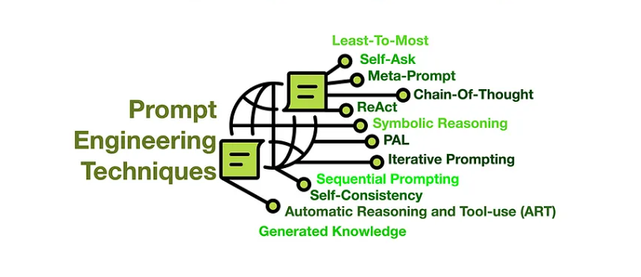
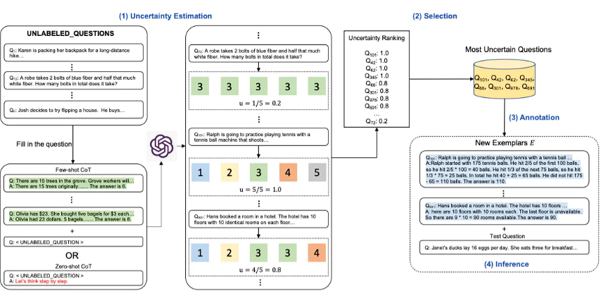

Prompt engineering 
=========================

**Prompt engineering** is the process of designing and creating prompts that are used to collect data from human annotators. The goal of prompt engineering is to create prompts that are clear, unambiguous, and easy to understand. This is important because the quality of the data collected from human annotators depends on the quality of the prompts used to collect the data.

In this sections we will cover all the prompt engineering techniques and how to use them to improve the quality of the prompt as well as some examples of how to use them in practice.

Zero shot :
---------------------
Zero-shot learning is a type of machine learning that allows a model to make predictions on a task without any training data. This is done by providing the model with a description of the task and a set of possible outputs, and then using the model to generate predictions based on this information. Zero-shot learning is useful in situations where there is limited training data available, or where it is not feasible to collect training data for a particular task.

**input** :

.. code-block:: text

    Classify the text into neutral, negative or positive. 

    Text: I think the vacation is okay.
    Sentiment:

**output** :

.. code-block:: text

    Sentiment: neutral

One shot :
---------------------
One-shot learning is a type of machine learning that allows a model to make predictions on a task with only one example of each class. This is done by providing the model with a description of the task and a set of possible outputs, and then using the model to generate predictions based on this information. One-shot learning is useful in situations where there is limited training data available, or where it is not feasible to collect training data for a particular task.

**input** :

.. code-block:: text

    Classify the text into neutral, negative or positive. 

    Text: I think the vacation is okay.
    Sentiment: neutral

    Text : I think the movie is bad.
    Sentiment:

**output** :

.. code-block:: text

    Sentiment: negative

Few shot :
---------------------
Few-shot learning is a type of machine learning that allows a model to make predictions on a task with only a few examples of each class. This is done by providing the model with a description of the task and a set of possible outputs, and then using the model to generate predictions based on this information. Few-shot learning is useful in situations where there is limited training data available, or where it is not feasible to collect training data for a particular task.

**input** :

.. code-block:: text

    Classify the text into neutral, negative or positive. 

    Text: I think the vacation is okay.
    Sentiment: neutral

    Text : I think the movie is bad.
    Sentiment: negative

    Text : I think the food is good.
    Sentiment:

**output** :

.. code-block:: text    

    Sentiment: positive

Chain of Thouths :
---------------------
Chain of thoughts is a technique used to generate prompts for a language model by chaining together a series of thoughts or ideas. This is done by providing the language model with a series of prompts, each of which builds on the previous prompt, and then using the model to generate a response based on the entire chain of prompts. Chain of thoughts is useful for generating prompts that are complex or multi-step in nature, as it allows the language model to build on previous prompts to generate a more coherent response.
**input** :

.. code-block:: text

    I went to the market and bought 10 apples. 
    I gave 2 apples to the neighbor and 2 to the repairman.
    I then went and bought 5 more apples and ate 1.
    How many apples did I remain with?

    Let's think step by step.

**output** :

.. code-block:: text

    First, you started with 10 apples.
    You gave away 2 apples to the neighbor and 2 to the repairman, so you had 6 apples left.
    Then you bought 5 more apples, so now you had 11 apples.
    Finally, you ate 1 apple, so you would remain with 10 apples.

self-consistency :
---------------------
Self-consistency is a technique used to generate prompts for a language model by asking the model to generate a response that is consistent with a given input. This is done by providing the language model with an input prompt and a target output, and then using the model to generate a response that is consistent with the target output. Self-consistency is useful for generating prompts that are consistent with a given input, as it allows the language model to generate responses that are coherent and logical.

self-consistency aims "to replace the naive greedy decoding used in chain-of-thought prompting". The idea is to sample multiple, diverse reasoning paths through few-shot CoT, and use the generations to select the most consistent answer. This helps to boost the performance of CoT prompting on tasks involving arithmetic and commonsense reasoning.Let's try it out. We will use the few-shot exemplars

**input** :

.. code-block:: text

    Q: There are 15 trees in the grove. Grove workers will plant trees in the grove today. After they are done,
    there will be 21 trees. How many trees did the grove workers plant today?
    A: We start with 15 trees. Later we have 21 trees. The difference must be the number of trees they planted.
    So, they must have planted 21 - 15 = 6 trees. The answer is 6.

    Q: If there are 3 cars in the parking lot and 2 more cars arrive, how many cars are in the parking lot?
    A: There are 3 cars in the parking lot already. 2 more arrive. Now there are 3 + 2 = 5 cars. The answer is 5.

    Q: Leah had 32 chocolates and her sister had 42. If they ate 35, how many pieces do they have left in total?
    A: Leah had 32 chocolates and Leah’s sister had 42. That means there were originally 32 + 42 = 74
    chocolates. 35 have been eaten. So in total they still have 74 - 35 = 39 chocolates. The answer is 39.

    Q: Jason had 20 lollipops. He gave Denny some lollipops. Now Jason has 12 lollipops. How many lollipops
    did Jason give to Denny?
    A: Jason had 20 lollipops. Since he only has 12 now, he must have given the rest to Denny. The number of
    lollipops he has given to Denny must have been 20 - 12 = 8 lollipops. The answer is 8.

    Q: Shawn has five toys. For Christmas, he got two toys each from his mom and dad. How many toys does
    he have now?
    A: He has 5 toys. He got 2 from mom, so after that he has 5 + 2 = 7 toys. Then he got 2 more from dad, so
    in total he has 7 + 2 = 9 toys. The answer is 9.

    Q: There were nine computers in the server room. Five more computers were installed each day, from
    monday to thursday. How many computers are now in the server room?
    A: There are 4 days from monday to thursday. 5 computers were added each day. That means in total 4 * 5 =
    20 computers were added. There were 9 computers in the beginning, so now there are 9 + 20 = 29 computers.
    The answer is 29.

    Q: When I was 6 my sister was half my age. Now I’m 70 how old is my sister?
    A:

**output 1** :

.. code-block:: text

    A: When you were 6, your sister was half your age, so she was 3. Now you are 70,
     so your sister is 70 - 6 + 3 = 67 years old.

**output 2** :

.. code-block:: text

    A: When you were 6, your sister was half your age, so she was 3. Now you are 70,
     so your sister is 70 - 6 + 3 = 67 years old.

**output 3** :

.. code-block:: text

    When I was 6 my sister was half my age, so she was 3. Now I am 70, so she is 70/2 = 35. 
    The answer is 35.

Although the final answer is wrong. We can see that there is already a majority answer emerging so that would essentially become the final answer.

Active prompt :
---------------------

Active prompting is a technique used to generate prompts for a language model by asking the model to generate a response that is consistent with a given input. This is done by providing the language model with an input prompt and a target output, and then using the model to generate a response that is consistent with the target output. Active prompting is useful for generating prompts that are consistent with a given input, as it allows the language model to generate responses that are coherent and logical.

Active prompt is combination of self-consistency and chain of thoughts. As we can see on the image above, the model is asked to generate a response 5 times and then the responses are compared to each other to find the most consistent one. before ranking the responses, to retrieve the most unconsistent ones, and use a CoT exemplars for better reasoning.