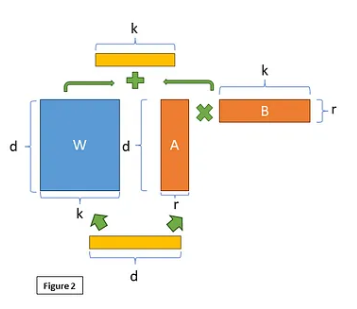
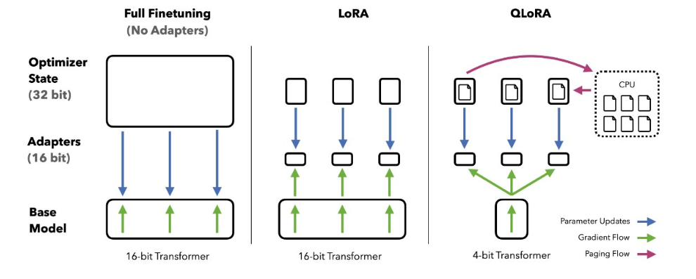

PEFT 
=====================

**PEFT: State-of-the-art Parameter-Efficient Fine-Tuning,-Efficient Fine-Tuning (PEFT)** methods enable efficient adaptation of large pretrained models
to various downstream applications by only fine-tuning a small number of (extra) model parameters instead of all the model’s parameters. This significantly
decreases the computational and storage costs. Recent state-of-the-art PEFT
techniques achieve performance comparable to fully fine-tuned models.
PEFT is integrated with Transformers for easy model training and inference, Diffusers for conveniently managing different adapters, and Accelerate for
distributed training and inference for really big models.

Why PEFT?
-------------------

There are many benefits of using PEFT but the main one is the huge savings
in compute and storage, making PEFT applicable to many different use cases

High performance on consumer hardware
--------------------------------------------
Consider the memory requirements for training the following models on the
**Twitter sentiment** dataset with an A100 80GB GPU with more than 64GB of
CPU RAM.

.. list-table:: Table 1: Resource usage comparison for different models and finetuning approaches.
   :widths: 25 25 25 25
   :header-rows: 1

   * - Model
     - Full Fine tuning
     - PEFT-LoRA PyTorch
     - PEFT-LoRA DeepSpeed with CPU Offloading
   * - bigscience/T0_3B (3B params)
     - 47.14GB GPU / 2.96GB CPU
     - 14.4GB GPU / 2.96GB CPU
     - 9.8GB GPU / 17.8GB CPU
   * - bigscience/mT0-xxl (12B params)
     - OOM GPU
     - 56GB GPU / 3GB CPU
     - 22GB GPU / 52GB CPU
   * - bigscience/bloomz-7b1 (7B params)
     - OOM GPU
     - 32GB GPU / 3.8GB CPU
     - 18.1GB GPU / 35GB CPU

ith LoRA you can fully finetune a 12B parameter model that would’ve otherwise run out of memory on the 80GB GPU, and comfortably fit and train a 3B
parameter model. When you look at the 3B parameter model’s performance, it
is comparable to a fully finetuned model at a fraction of the GPU memory.

Low-Rank Adaptation (LoRA)
----------------------------------

**Low-Rank Adaptation (LoRA)** is a PEFT method that decomposes large weight
matrices into smaller matrices, which are easier to train. It focuses on finetuning these low-rank matrices without modifying the original pre-trained weights.

.. image:: images/LORA.png
   :width: 50%
   :align: center

The figure illustrates the principle of Low-Rank Adaptation (LoRA) applied
to a pre-trained weight matrix in neural networks. The LoRA technique modifies
the pre-trained weights W ∈ Rd × d
through the addition of a low-rank update,effectively fine-tuning the model without altering the entire weight matrix. This
update is represented as the sum of the product of an input vector x, a trainable
low-rank matrix A, which is normally distributed with mean zero and variance
σ²
, and another low-rank matrix B, which is initialized to zero. The equation
reflecting this adaptation is given by:

                                h = Wx + A · x · B               (1)

where h is the output vector, and the matrices A and B have much lower
dimensions compared to W, thus enabling efficient training with reduced computational resources.

Why LoRA?
-------------------
1. Efficient memory usage by reducing trainable parameters.
2. The preservation of original weights allows multiple LoRA fine-tunings atop the same base model.
3. Compatible with various PEFT methods.
4. Maintains full fine-tuning performance levels.
5. No added inference latency.
   
Implementation in Transformers
-----------------------------------
LoRA is applied to attention blocks in Transformer models for added efficiency,
and the number of trainable parameters is contingent on the size of the low-rank
matrices and the rank value.

 It is easy to configure LoRA with your fine tuning notebook just copy the following cell and bingo.

.. code-block:: python

    from peft import LoraConfig, TaskType
    lora_config = LoraConfig(
    r=4, # Set your own rank (e.g 2,4,8,16,32.....)
    lora_alpha=8,
    target_modules=["q", "v"],
    lora_dropout=0.05,
    bias="none",
    task_type=TaskType.SEQ_2_SEQ_LM # FLAN-T5
    )

The above code snippet demonstrates how to apply LoRA to a pre-trained
BERT model for sequence classification. The rank parameter specifies the
rank value, and the low_rank_dim parameter specifies the size of the low-rank
matrices. The model is then passed to the Trainer class for training.

Qlora 
---------------

Quantization of LLMs has largely focused on quantization for inference, but
the QLoRA (Quantized model weights + Low-Rank Adapters) paper showed
the breakthrough utility of using backpropagation through frozen, quantized
weights at large model scales.
With QLoRA we are matching 16-bit fine-tuning performance across all
scales and models, while reducing fine-tuning memory footprint by more than
90% thereby allowing fine-tuning of SOTA models on consumer-grade hardware.
In this approach, LoRA is pivotal both for purposes of fine-tuning and the
correction of minimal, residual quantization errors. Due to the significantly
reduced size of the quantized model it becomes possible to generously place
low-rank adaptors at every network layer, which together still make up just
0.2% of the original model’s weight memory footprint. Through such usage of
LoRA, we achieve performance that has been shown to be equivalent to 16-bit
full model finetuning.

Implementing QLoRA
-----------------------------------

These SOTA quantization methods come
packaged in the bitsandbytes library and are conveniently integrated with HuggingFace Transformers. For instance, to use LLM.int8 and QLoRA algorithms,
respectively, simply pass load-in-8bit and load-in-4bit to the from-pretrained
method.

.. code-block:: python

    # QLoRA Configuration in python
    import torch
    from transformers import AutoModelForCausalLM, AutoTokenizer
    model_id = "facebook/opt-125m"
    # For LLM.int8()
    # model = AutoModelForCausalLM.from_pretrained(model_id, load_in_8bit=True)
    # For QLoRA
    model = AutoModelForCausalLM.from_pretrained(model_id, load_in_4bit=True)

Putting everything together
-----------------------------------

We made a complete reproducible `Collab Notebook <https://colab.research.google.com/drive/1CA4NXtXrnUCCFdx8l37uC1EMTuqORYbZ?usp=sharing>`_
notebook that you can check
through this . The notebook demonstrates how to fine-tune a llama model on a pyhron code dataset named flytech/python-codes-25k
using LUDWIG . 

