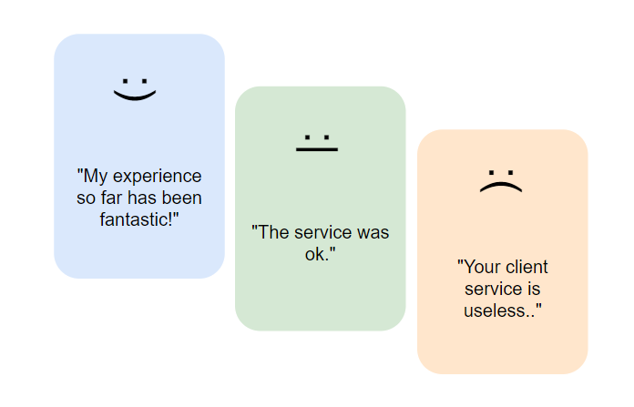
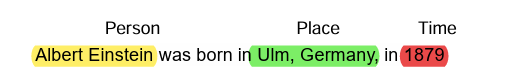
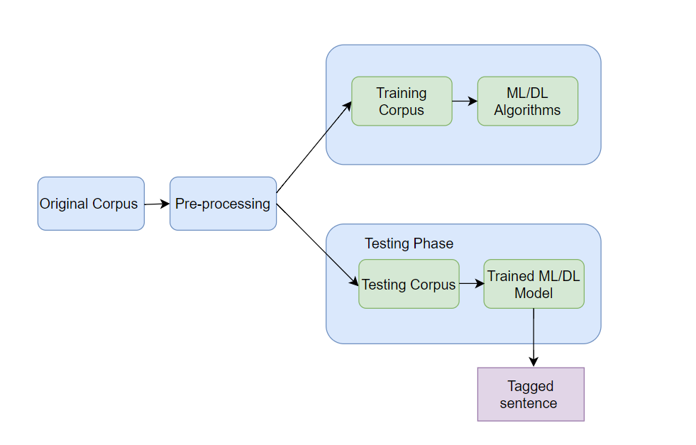

Applications of LLMs
===================

NLP Tasks Overview
------------------

Natural Language Processing (NLP) is a branch of artificial intelligence (AI) aimed at reaching human-computer interaction through the natural language. Its goal is to enable computers to understand, interpret, and respond to human language in a meaningful manner.

Practical uses of NLP encompass speech recognition, machine translation, sentiment analysis, and entity extraction.

Large Language Models (LLMs), a significant advancement in NLP, leverage increased computing capabilities, abundant data, and machine learning innovations. By digesting vast text corpora, these models discern language patterns, grammatical rules, world knowledge, and reasoning capabilities.

Sentiment Analysis
------------------
Sentiment analysis not only assesses the general sentiment polarity of text (positive, negative, neutral) but also goes into detecting specific emotions (e.g., joy, frustration, anger, sorrow), levels of urgency (urgent, non-urgent), and intentions (interested vs. uninterested)

   Customer Feed-Back Sentiment Classification

Graded Sentiment Analysis (Fine-Grained Sentiment Analysis)
^^^^^^^^^^^^^^^^^^^^^^^^^^^^^^^
For businesses where understanding the precise level of sentiment is necessary, expanding the range of sentiment categories to capture various degrees of positivity or negativity can be beneficial:

- Very positive

- Positive

- Neutral

- Negative

- Very negative

Emotion Detection
^^^^^^^^^^^^^^^^^
This approach extends beyond simple polarity to identify specific emotions, such as happiness, frustration, anger, or sadness.

Aspect-Based Sentiment Analysis
^^^^^^^^^^^^^^^^^^^^^^^^^^^^

This analysis focuses on identifying sentiments related to specific aspects or features mentioned in texts, determining whether the sentiments are positive, neutral, or negative.
For instance, in the review, "The battery life of this laptop is too short", aspect-based analysis would pinpoint the negative sentiment directed towards the laptop's battery life.

Example:Sentiment Analysis with Python and NLTK
Objective:To determine the sentiment of a given text (positive, negative, or neutral) using the NLTK library.

`Click here for example`_.

.. _Click here for example: https://jupyter.org/try-jupyter/notebooks/?path=Sentiment_analysis.ipynb

Named Entity Recognition (NER)
------------------------------
Named entity recognition (NER) — sometimes referred to as entity chunking, extraction, or identification — is the task of identifying and categorizing key information (entities) in text. An entity can be any word or series of words that consistently refers to the same thing. Every detected entity is classified into a predetermined category. For example, an NER machine learning (ML) model might detect the word "ENSAM" in a text and classify it as a "College".

How does NER works?
At the heart of any NER model is a two step process:
-Detect a named entity
-Categorize the entity

Step one involves detecting a word or string of words that form an entity.Each word represents a token:The ATLAS mountains” is a string of three tokens that represents one entity.

The second step requires the creation of entity categories.
To learn what is and is not a relevant entity and how to categorize them, a model requires training data. The more relevant that training data is to the task, the more accurate the model will be at completing said task.

    Example of NER e.g Name Entity Recognition
   

Example:Named Entity Recognition (NER)
Objective:NER capabilities using spaCy to identify various types of entities in a text, such as persons, organizations, locations...

`Click here for example`_

.. _Click here for example: https://jupyter.org/try-jupyter/notebooks/?path=NameEntityRecognition.ipynb

Part-Of-Speech Tagging (PoS)
---------------------------
Part-of-speech tagging, a fundamental aspect of natural language processing, involves assigning syntactic tags to each word in a sentence based on its context. Also known as grammatical tagging, this process categorizes words into grammatical groups like verbs, adjectives, nouns, etc.

.. table:: Example of Part of Speech Tags
   :name: tab:pos_tags

   +----------------+------+
   | Part of Speech | Tag  |
   +================+======+
   | Noun           | n    |
   +----------------+------+
   | Verb           | v    |
   +----------------+------+
   | Adjective      | a    |
   +----------------+------+
   | Adverb         | r    |
   +----------------+------+

Words behave differently given different contexts in most languages, and thus the difficulty is to identify the correct tag of a word appearing in a particular sentence. Several approaches have been deployed to automatic POS tagging, like transformational-based, rule-based and probabilistic approaches.

Rule-Based POS Tagging
^^^^^^^^^^^^^^^^^^
This traditional method utilizes a lexicon to suggest possible tags for each word. Disambiguation is achieved through hand-written rules considering the word's context and neighboring words.

Defining a set of rules for assigning POS tags to words. For example:
+If the word ends in “-tion,” assign the tag “noun.”
+If the word ends in “-ment,” assign the tag “noun.”
+If the word is all uppercase, assign the tag “proper noun.”
+If the word is a verb ending in “-ing,” assign the tag “verb.”

Example:PoS tagging
Objective:how to perform PoS tagging on a given sentence, assigning grammatical parts of speech to each word, such as nouns, verbs, adjectives, etc.

`Click here for example`_

.. _Click here for example: https://jupyter.org/try-jupyter/notebooks/? path=PartOfSpeechTagging.ipynb

Artificial Neural Networks (ANN)
^^^^^^^^^^^^^^^^^^^^^^^^
ANNs for POS tagging involve preprocessing to prepare input for the network. The network then adjusts its weights during training to predict accurate tags.

   Use of ML/DL in PoS
   

Hidden Markov Model (HMM)
^^^^^^^^^^^^^^^^^
HMM, a prevalent stochastic method, uses a state transition framework where the tags are inferred from observable outputs dependent on hidden states.It follows a factual Markov model in which the tagger framework being demonstrated is thought to be explored from one state to another with an inconspicuous state.
Unlike the Markov model, in HMM, the state is not directly observable to the observer, but the output that depends on the hidden state is visible. Hidden Markov Model is a familiar statistical model that is used to find the most frequent tag sequence T=(t1, t2, t3… tn) for a word sequence in sentence W=(w1, w2, w3…wn).

Transformation-Based Tagging (TBT)
^^^^^^^^^^^^^^^^^^^^^^^^
TBT applies rules to transform word tags based on their context. Unlike rule-based tagging, TBT dynamically updates tags by applying rules in sequence, such as changing a verb to a noun if preceded by a determiner.
In TBT, a set of rules is defined to transform the tags of words in a text based on the context in which they appear. 

For example, a rule might change the tag of a verb to a noun if it appears after a determiner such as “the” .
The rules are applied to the text in a specific order, and the tags are updated after each transformation.
Here is an example of how a TBT system might work:
Defining a set of rules for transforming the tags of words in the text.

+If the word is a verb and appears after a determiner, change the tag to “noun”.
+If the word is a noun and appears after an adjective, change the tag to “adjective”.
+Iterate through the words in the text and apply the rules in a specific order.

For example: 
In the sentence “The cat sat on the mat ”, the word “sat” would be changed from a verb to a noun based on the first rule.
In the sentence “The red cat sat on the mat ”, the word “red” would be changed from an adjective to a noun based on the second rule.

Machine Translation
^^^^^^^^^^^^^^^^^^^
Machine Translation (MT) is a domain of computational linguistics that uses computer programs to translate text or speech from one language to another with no human involvement with the goal of relatively high accuracy, low errors, and effective cost.
The basic requirement in the complex cognitive process of machine translation is to understand the meaning of a text in the original (source) language and then restore it to the target (sink) language.

The primary steps in the machine translation process are:
-We need to decode the meaning of the source text in its entirety.
-We also require an in-depth knowledge of the grammar, semantics, syntax, idioms, etc. of the source language for this process.
-We then need to re-encode this meaning in the target language, which also needs the same in-depth knowledge as the source language to replicate the meaning in the target language.

Example:Machine Translation
Objective:emonstrating how to translate text from English to French using a pre-trained model..

`Click here for example`_

.. _Click here for example: https://jupyter.org/try-jupyter/notebooks/?path=MachineTranslation.ipynb

Rule-based Machine Translation or RBMT
^^^^^^^^^^^^^^^^^^^^^^
Also called knowledge-based machine translation, these are the earliest set of classical methods used for machine translation.

These translation systems are mainly based on linguistic information about the source and target languages that are derived from dictionaries and grammar covering the characteristic elements of each language separately.

Corpus-based Machine Translation Approach or CBMT
^^^^^^^^^^^^^^^^^^^^^^^^^^^^^^
Corpus-Based Machine Translation uses bilingual parallel corpora as a foundational dataset to inform and guide the translation of new text. 

This method relies on extensive databases of raw text paired with their corresponding translations, utilizing these parallel texts to derive insights and patterns for translation tasks.

Example-based Machine Translation or EBMT
^^^^^^^^^^^^^^^^^^^^^^
Example-based machine translation systems are trained from bilingual parallel corpora where the sentence pairs contain sentences in one language with their translations into another.

The principle of translation by analogy is encoded to the example-based machine translation through the example translations that are used to train the system.

Here's a simplified example using English and French:
Suppose we have a bilingual corpus with the following sentence pairs:

English : "The cat sat on the mat".
French: "Le chat s'est assis sur le tapis".

English:"She sat by the river".
French: "Elle s'est assise au bord de la rivière."

Now, if we want to translate a new English sentence using the EBMT approach:

English: "The cat sat by the window".

The EBMT system will:
1. Identify segments from the known examples that can be reused:
 -"The cat sat" can be matched with "Le chat s'est assis" from the first pair.
 
 -"by" can be associated with "au bord" from the second pair, though this is not a direct match.

2. Adjust for the new context:
-"The window" has no direct match, but based on "on the mat" and the structure of the French sentence, the system may infer the correct preposition "à" for the English "by."

3. Assemble the translated segments:
-"Le chat s'est assis" + "à" + "la fenêtre" (where "la fenêtre" is the translation of "the window").

4. Generate the translated sentence:-"Le chat s'est assis à la fenêtre."

Here, the EBMT system uses fragments of known translations to construct the translation of a new sentence. It requires a comprehensive bilingual corpus to increase the accuracy and fluency of the translations it produces.
