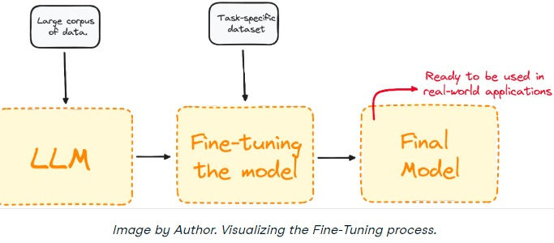
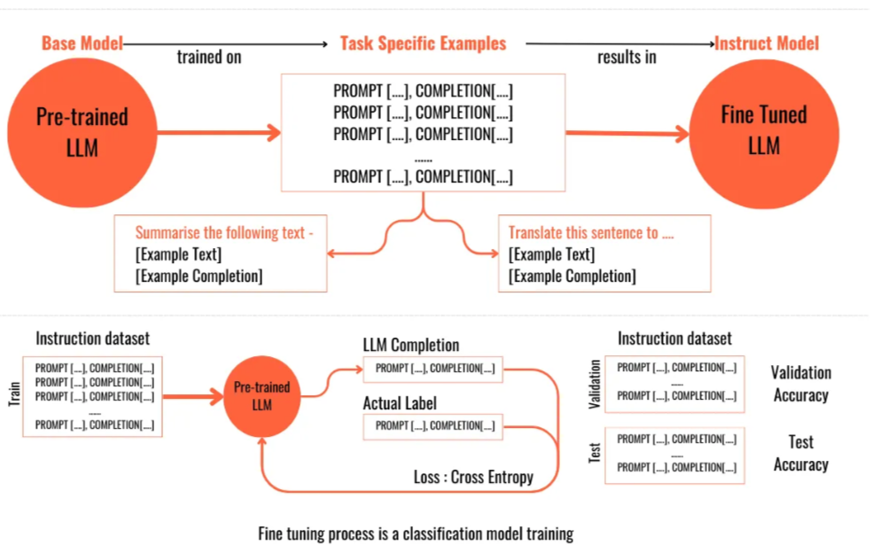
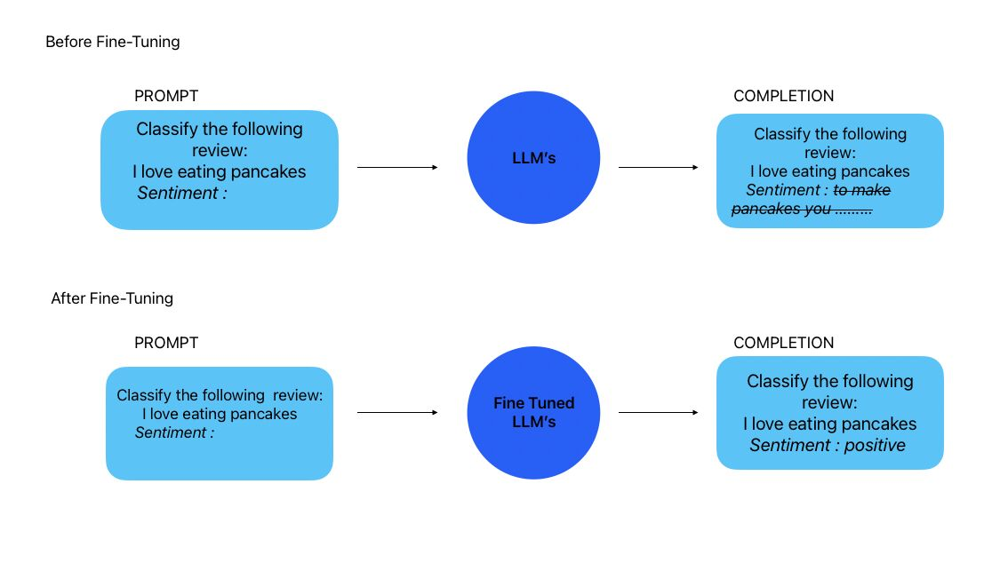
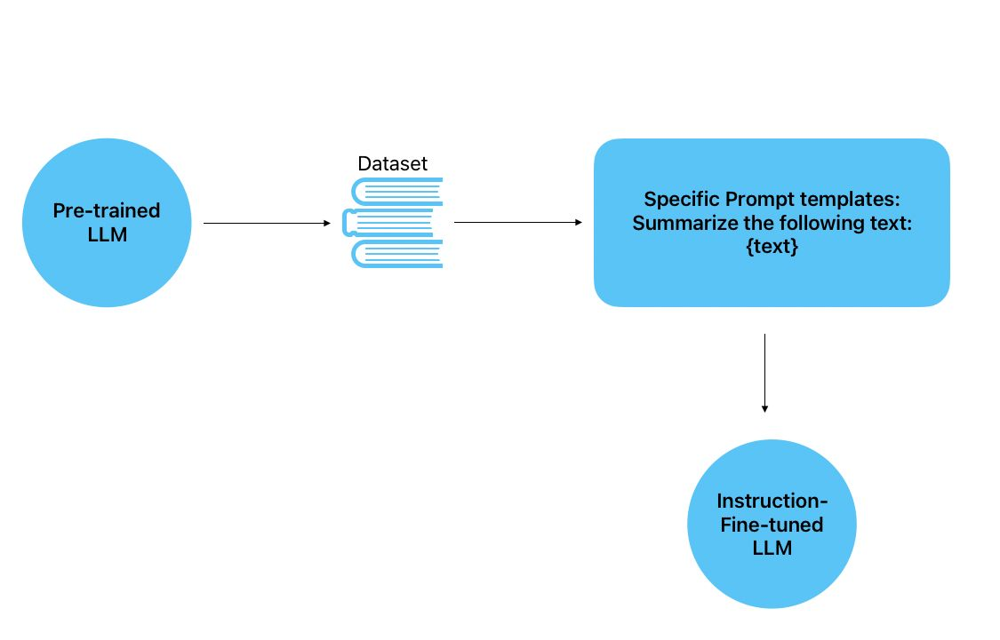
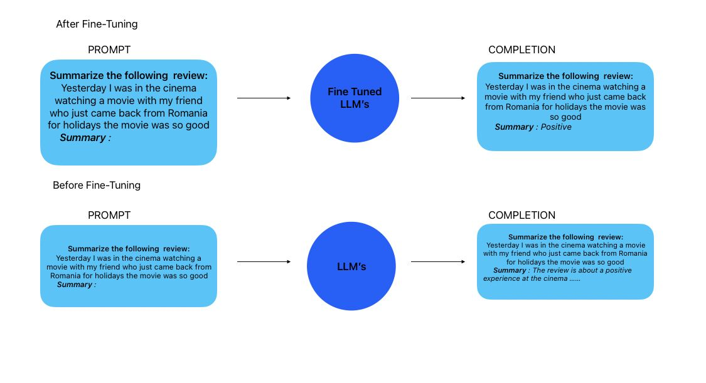
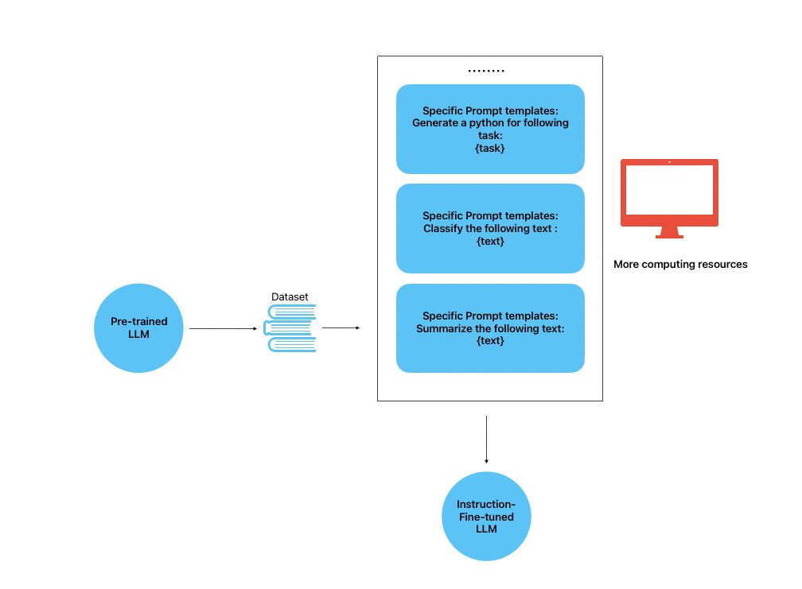
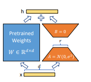
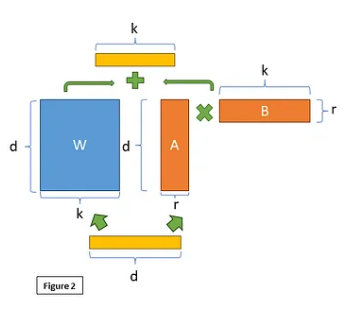
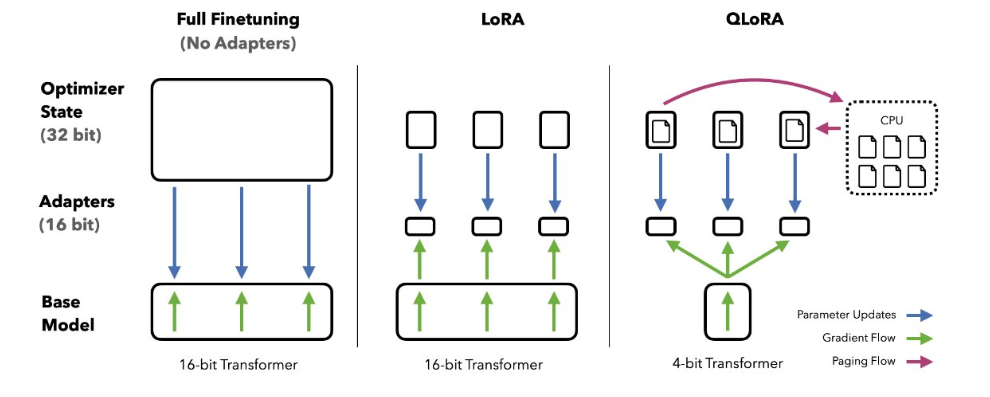

Fine-tuning techniques
======================

Models like GPT-3, which have been pre-trained on extensive datasets, possess a strong foundation in general language skills and knowledge. This allows them to perform well right from the start. However, their expertise remains broad. To tailor them for specific industries and tasks, we can further refine these models using smaller, targeted datasets. For instance, although GPT-3 is not explicitly trained to produce Python code, we can fine-tune it with Python-related data to make it proficient in that area.

The process of fine-tuning modifies the model's internal parameters, skewing them towards the new information without erasing its previously acquired knowledge. This way, the model maintains its general abilities while acquiring new, specialized expertise.

If you're wondering how to do this, don't worry—we've got you covered.

How to Fine-tune a Large Language Model (LLM)
-----------------------------------------------

Here is an overview of the fine-tuning process for a model like GPT-3:

1. Begin with a pre-trained model, such as GPT-3.

2. Collect a dataset tailored to your specific task, known as the "fine-tuning set."

3. Feed examples from the fine-tuning set to the model and record its predictions.

4. Compute the loss by comparing the model's predictions to the expected outcomes.

5. Use gradient descent and backpropagation to adjust the model's parameters, aiming to minimize the loss.

6. Repeat steps 3-5 over multiple epochs until the model's performance stabilizes.

7. Once fine-tuned, the model is ready for deployment on new, unseen data.

.. insert a image from local file

For effective fine-tuning, the training dataset should be of high quality and
relevant to the target task. Typically, a few hundred to a few thousand examples
are required to fine-tune a large model successfully.Let’s get into more details.

This diagram shows the fine-tuning of a pre-trained LLM. It starts with the
base model learning from general prompts and completions. Then, for finetuning, it’s given specific tasks and correct responses to learn from. It’s trained
and validated to improve its task accuracy, transforming it into a fine-tuned
LLM specialized for particular functions.
And we can simply put it this way :

The image contrasts the output of a pre-trained LLM with that of a finetuned LLM. Before fine-tuning, the LLM gives an incorrect completion to asentiment analysis prompt. After fine-tuning, the same prompt receives an
accurate positive sentiment completion, demonstrating the effectiveness of the
fine-tuning process.

Instruction Fine-Tuning :
-------------------------

Instruction tuning or Instruction fine-tuning represents a specialized form of fine-tuning in which a model
is trained using pairs of input-output instructions, enabling it to learn specific
tasks guided by these instructions.

Instruction fine-tuning is particularly useful for training models to perform
complex tasks that require precise, step-by-step instructions. By providing
detailed guidance, the model can learn to follow the instructions accurately and
produce the desired output.

The image depicts the instruction fine-tuning process for a pre-trained LLM.
The model is fine-tuned with a dataset and specific prompts that instruct it to
summarize text. This process results in an LLM that has been specially trained
to generate summaries, reflecting a targeted improvement in this particular task.
Later on this article you will learn how to instruct fine-tune your own LLM
using a framework called LUDWIG.

Catasrophic Forgetting :
------------------------
One of the challenges of fine-tuning is catastrophic forgetting. This phenomenon occurs when a model forgets previously learned information while adapting to new data. To mitigate this issue, researchers have developed various techniques, such as elastic weight consolidation (EWC) and synaptic intelligence (SI), which help models retain their original knowledge during fine-tuning.

Or we can say Catastrophic forgetting (CF) is a phenomenon that occurs in machine learning
when a model forgets previously learned information as it learns new information.

This statement highlights the issue of catastrophic forgetting in fine-tuned
LLMs. The same LLM, initially capable of both sentiment analysis and summarization,struggles with summarization after being fine-tuned for sentiment analysis. This exemplifies the problem where an LLM, post fine-tuning, may lose its ability to perform tasks it could handle before, emphasizing the need for strategies to retain previous knowledge while incorporating new capabilities.

How to prevent Catastrophic Forgetting :
----------------------------------------
Researchers have developed several strategies to tackle catastrophic forgetting
in LLMs:

1. **Elastic Weight Consolidation (EWC)**: EWC is a regularization technique that
   helps LLMs retain previously learned information while fine-tuning on new
   tasks. By assigning importance weights to the model's parameters based on
   their relevance to the original task, EWC helps prevent catastrophic forgetting.

2. **Synaptic Intelligence (SI)**: SI is another regularization method that addresses

3. **Multi-Task Learning**: Training an LLM on multiple tasks simultaneously can
   help prevent catastrophic forgetting. By exposing the model to diverse tasks
   during training, it learns to balance its knowledge across different domains,
   reducing the risk of forgetting.

4. **Full fine-tuning**: In some cases, full fine-tuning may be necessary to achieve
   optimal performance on a specific task. While this approach can lead to
   catastrophic forgetting, it may be the most effective way to adapt the model to
   the new task.

5. **Knowledge Distillation**: Knowledge distillation involves transferring the
   knowledge from a large, pre-trained model to a smaller, task-specific model.
   By distilling the information from the larger model, the smaller model can
   benefit from the pre-trained knowledge without the risk of catastrophic
   forgetting.

6. **PEFT** : Parameter Efficient Fine-Tuning (PEFT) is a technique that aims to
   minimize catastrophic forgetting by fine-tuning only a subset of the model's
   parameters. By identifying and updating the most relevant parameters for the
   new task, PEFT helps preserve the model's original knowledge while adapting
   to the new task.

Instruction Multi-Fine-Tuning :
-------------------------------
In order to prevent the (CF) phenomena, we want to make sure to train our
model on a variety of tasks, So the model can no longer forget how to preform
every task.

Instruction Multi-Fine-Tuning is a technique that involves fine-tuning a model
on multiple tasks simultaneously using instruction-based training. By providing
detailed instructions for each task, the model can learn to perform a diverse
range of tasks without forgetting previously acquired knowledge.

This image outlines the instruction multi-task fine-tuning process. A pretrained LLM is further trained with a dataset and various specific prompt templates for different tasks, like generating Python code, classifying text, and summarizing text. This multi-task fine-tuning requires more computing resources
and results in a more versatile

PEFT 
------------

**PEFT: State-of-the-art Parameter-Efficient Fine-Tuning,-Efficient Fine-Tuning (PEFT)** methods enable efficient adaptation of large pretrained models
to various downstream applications by only fine-tuning a small number of (extra) model parameters instead of all the model’s parameters. This significantly
decreases the computational and storage costs. Recent state-of-the-art PEFT
techniques achieve performance comparable to fully fine-tuned models.
PEFT is integrated with Transformers for easy model training and inference, Diffusers for conveniently managing different adapters, and Accelerate for
distributed training and inference for really big models.

Why PEFT?
-------------------

There are many benefits of using PEFT but the main one is the huge savings
in compute and storage, making PEFT applicable to many different use cases

High performance on consumer hardware
--------------------------------------------
Consider the memory requirements for training the following models on the
**Twitter sentiment** dataset with an A100 80GB GPU with more than 64GB of
CPU RAM.

.. list-table:: Table 1: Resource usage comparison for different models and finetuning approaches.
   :widths: 25 25 25 25
   :header-rows: 1

   * - Model
     - Full Fine tuning
     - PEFT-LoRA PyTorch
     - PEFT-LoRA DeepSpeed with CPU Offloading
   * - bigscience/T0_3B (3B params)
     - 47.14GB GPU / 2.96GB CPU
     - 14.4GB GPU / 2.96GB CPU
     - 9.8GB GPU / 17.8GB CPU
   * - bigscience/mT0-xxl (12B params)
     - OOM GPU
     - 56GB GPU / 3GB CPU
     - 22GB GPU / 52GB CPU
   * - bigscience/bloomz-7b1 (7B params)
     - OOM GPU
     - 32GB GPU / 3.8GB CPU
     - 18.1GB GPU / 35GB CPU

ith LoRA you can fully finetune a 12B parameter model that would’ve otherwise run out of memory on the 80GB GPU, and comfortably fit and train a 3B
parameter model. When you look at the 3B parameter model’s performance, it
is comparable to a fully finetuned model at a fraction of the GPU memory.

Low-Rank Adaptation (LoRA)
----------------------------------

**Low-Rank Adaptation (LoRA)** is a PEFT method that decomposes large weight
matrices into smaller matrices, which are easier to train. It focuses on finetuning these low-rank matrices without modifying the original pre-trained weights.

The figure illustrates the principle of Low-Rank Adaptation (LoRA) applied
to a pre-trained weight matrix in neural networks. The LoRA technique modifies
the pre-trained weights W ∈ Rd × d
through the addition of a low-rank update,effectively fine-tuning the model without altering the entire weight matrix. This
update is represented as the sum of the product of an input vector x, a trainable
low-rank matrix A, which is normally distributed with mean zero and variance
σ²
, and another low-rank matrix B, which is initialized to zero. The equation
reflecting this adaptation is given by:

                                h = Wx + A · x · B               (1)

where h is the output vector, and the matrices A and B have much lower
dimensions compared to W, thus enabling efficient training with reduced computational resources.

Why LoRA?
-------------------
1. Efficient memory usage by reducing trainable parameters.
2. The preservation of original weights allows multiple LoRA fine-tunings atop the same base model.
3. Compatible with various PEFT methods.
4. Maintains full fine-tuning performance levels.
5. No added inference latency.
   
Implementation in Transformers
-----------------------------------
LoRA is applied to attention blocks in Transformer models for added efficiency,
and the number of trainable parameters is contingent on the size of the low-rank
matrices and the rank value.

 It is easy to configure LoRA with your fine tuning notebook just copy the following cell and bingo.

.. code-block:: python

    from peft import LoraConfig, TaskType
    lora_config = LoraConfig(
    r=4, # Set your own rank (e.g 2,4,8,16,32.....)
    lora_alpha=8,
    target_modules=["q", "v"],
    lora_dropout=0.05,
    bias="none",
    task_type=TaskType.SEQ_2_SEQ_LM # FLAN-T5
    )

The above code snippet demonstrates how to apply LoRA to a pre-trained
BERT model for sequence classification. The rank parameter specifies the
rank value, and the low_rank_dim parameter specifies the size of the low-rank
matrices. The model is then passed to the Trainer class for training.

Qlora 
---------------

Quantization of LLMs has largely focused on quantization for inference, but
the QLoRA (Quantized model weights + Low-Rank Adapters) paper showed
the breakthrough utility of using backpropagation through frozen, quantized
weights at large model scales.
With QLoRA we are matching 16-bit fine-tuning performance across all
scales and models, while reducing fine-tuning memory footprint by more than
90% thereby allowing fine-tuning of SOTA models on consumer-grade hardware.
In this approach, LoRA is pivotal both for purposes of fine-tuning and the
correction of minimal, residual quantization errors. Due to the significantly
reduced size of the quantized model it becomes possible to generously place
low-rank adaptors at every network layer, which together still make up just
0.2% of the original model’s weight memory footprint. Through such usage of
LoRA, we achieve performance that has been shown to be equivalent to 16-bit
full model finetuning.

Implementing QLoRA
-----------------------------------

These SOTA quantization methods come
packaged in the bitsandbytes library and are conveniently integrated with HuggingFace Transformers. For instance, to use LLM.int8 and QLoRA algorithms,
respectively, simply pass load-in-8bit and load-in-4bit to the from-pretrained
method.

.. code-block:: python

    # QLoRA Configuration in python
    import torch
    from transformers import AutoModelForCausalLM, AutoTokenizer
    model_id = "facebook/opt-125m"
    # For LLM.int8()
    # model = AutoModelForCausalLM.from_pretrained(model_id, load_in_8bit=True)
    # For QLoRA
    model = AutoModelForCausalLM.from_pretrained(model_id, load_in_4bit=True)

Putting everything together
-----------------------------------

We made a complete reproducible `Collab Notebook <https://colab.research.google.com/drive/1CA4NXtXrnUCCFdx8l37uC1EMTuqORYbZ?usp=sharing>`_
notebook that you can check
through this . The notebook demonstrates how to fine-tune a llama model on a pyhron code dataset named flytech/python-codes-25k
using LUDWIG . 

