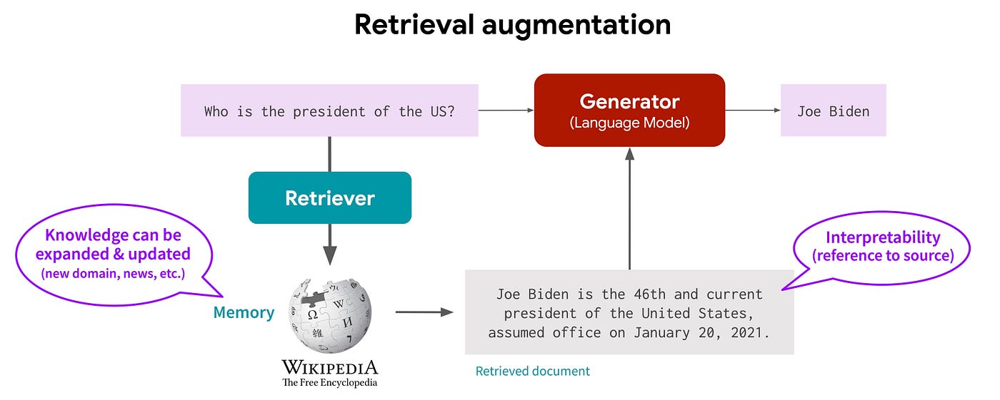

Retrieval-Augmented Generation (RAG) 
=======================================================================

Introduction
------------

Pre-trained language models like BERT and GPT have shown impressive capabilities in storing and utilizing factual knowledge for downstream NLP tasks. However, their precision in knowledge manipulation and provenance of decisions remains a challenge, especially in knowledge-intensive applications. RAG models seek to address these limitations by integrating parametric (pre-trained models) with non-parametric (external knowledge bases) memory, fine-tuned end-to-end for a wide array of tasks.

Methodology
-----------

The RAG framework is a fine-tuning recipe for seq2seq models augmented with a retrieval component. It comprises two variants: RAG-Sequence, which uses the same document for the entire sequence, and RAG-Token, allowing different documents per token. The models use a retriever (like DPR) to fetch relevant documents based on the input and a generator (such as BART) conditioned on these documents and the input to produce outputs.

Retriever
----------

The retriever is a dense retrieval model that uses a bi-encoder architecture to encode documents and queries into dense vectors. It uses a dot-product similarity function to rank documents based on their relevance to the query. The retriever is trained on a large corpus of documents and queries using a contrastive loss function.

Generator
----------

The generator is a seq2seq model that takes the input and the retrieved documents as input and generates the output. The generator is trained end-to-end with the retriever using a multi-task loss function that combines the retrieval and generation losses.

Training
---------

The RAG model is trained end-to-end using a multi-task loss function that combines the retrieval and generation losses. The retriever is trained on a large corpus of documents and queries using a contrastive loss function. The generator is trained on a dataset of input-output pairs using a cross-entropy loss function.

Putting it all together:
-------------------------

The RAG model is a powerful framework for knowledge-intensive NLP tasks that combines the strengths of parametric and non-parametric memory. It can be fine-tuned for a wide array of tasks, including question answering, text summarization, and dialogue generation. The RAG model has shown impressive performance on a variety of benchmarks and is a promising direction for future research in NLP.
You can also check this `Notebook <https://colab.research.google.com/drive/1otEUVgCygtV96NuymO1fq-tpF8F3WS5l?usp=sharing>`_ for more details.
