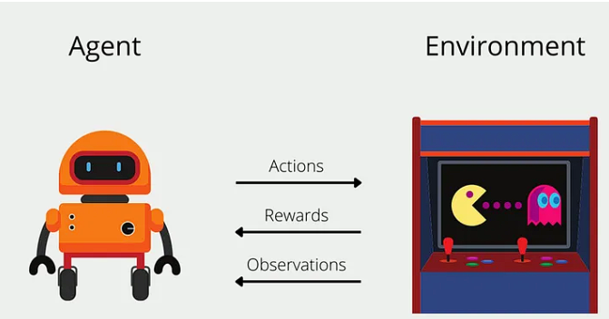
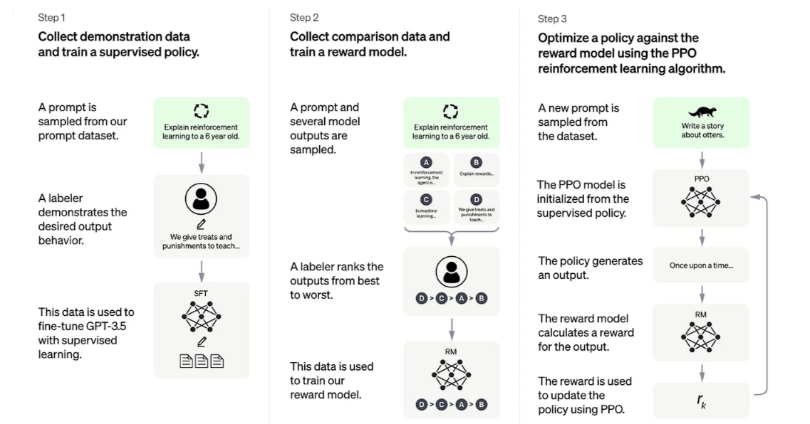
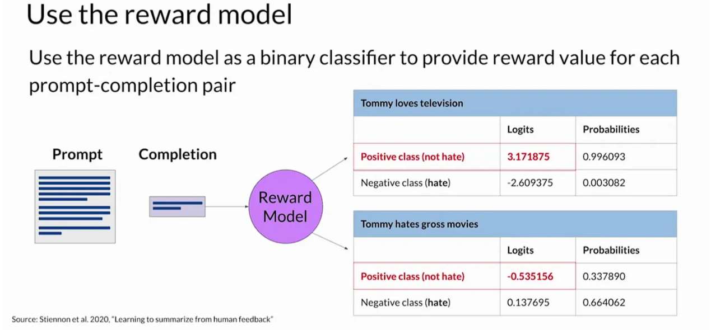
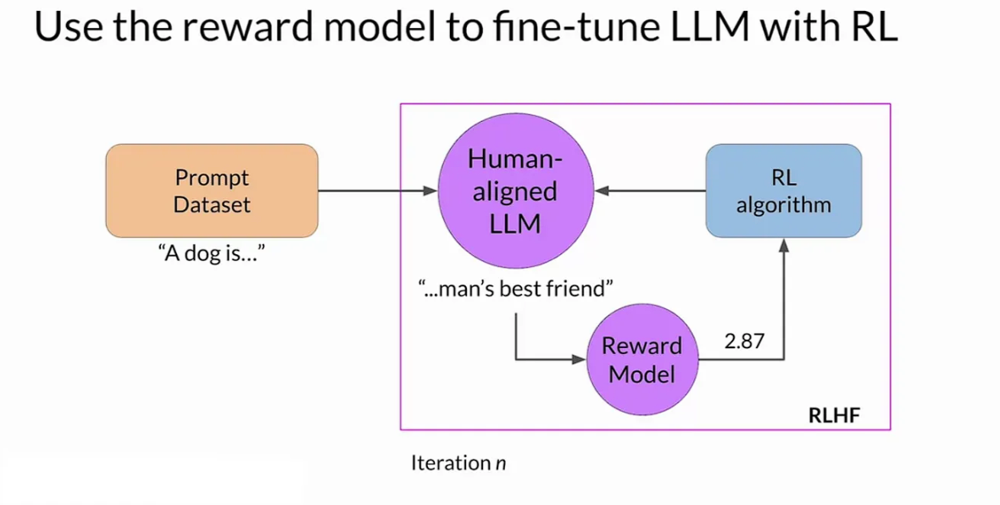
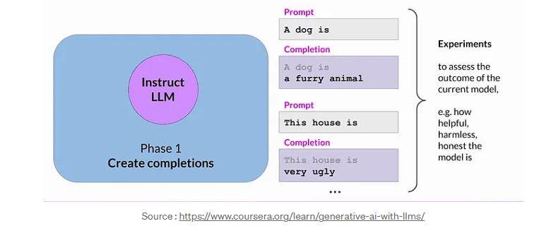
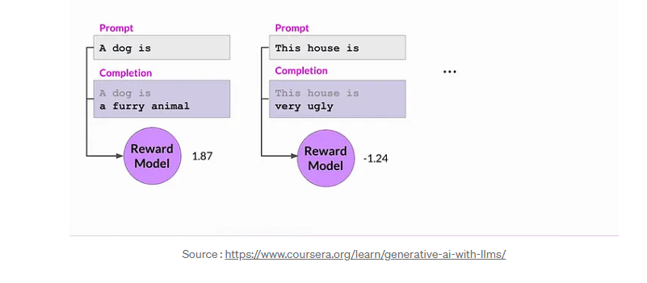
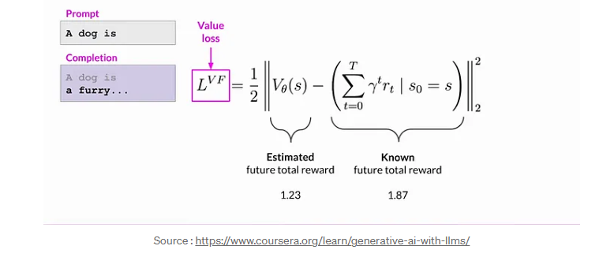
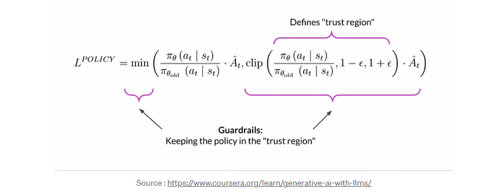
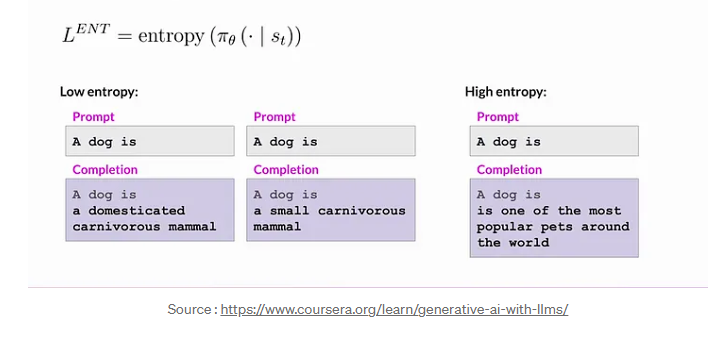
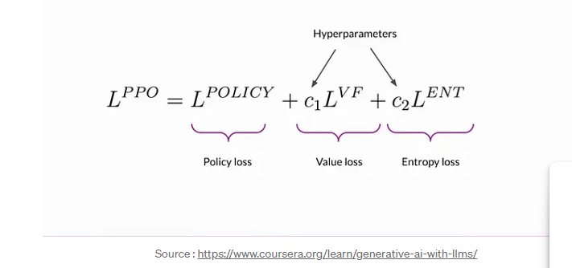

Reinforcement Learning from Human Feedback
==========================================

**RLHF** steps ahead of conventional training methods, offering a pathway where AI systems learn not just from pre-programmed data, but from the richness of human feedback.

This approach embraces the subtleties, intricacies, and ethical dimensions of human communication.

In this section , we will be talking about RLHF and how it has been a crucial step in the development of LLMs. Its name is pretty much descriptive, Reinforcement Learning which is combined with Human Feedback.

Let’s start by explaining what is Reinforcement Learning for those of you who are not familiar with the concept.

Reinforcement Learning 
-----------------------

Reinforcement Learning or RL is a type of machine learning that enables an agent to learn in an interactive environment by trial and error using feedback from its actions and experiences.

**Agent** - The learner or decision-maker that interacts with the environment.

**Environment** - The external context in which the agent operates.

**State** - The current situation of the agent.

**Observation** - The data received by the agent from the environment.

**Action** - The decision made by the agent.

**Reward** - The feedback from the environment that tells the agent how good or bad its actions were.

**Policy** - The strategy or rule that the agent uses to make decisions.

**Value Function** - The expected reward that the agent will receive in the future.

**Model** - The agent's representation of the environment.

Practical example
------------------

Let’s say we have a robot that needs to learn how to walk. The robot is the agent, the environment is the room, the state is the position of the robot, the observation is the data from the sensors, the action is the movement of the robot, the reward is the feedback from the environment, the policy is the strategy to walk, the value function is the expected reward, and the model is the representation of the room.

The robot will try different actions, receive feedback from the environment, and learn from its experiences to improve its performance.

Reinforcement Learning For Language Models
------------------------------------------

The use of the Reinforcement Learning in the development of Large Language Models (LLMs), particularly in the RLHF approach, is crucial for the following reasons:

1. **Data Efficiency** - RLHF enables LLMs to learn from human feedback, which is more informative and data-efficient than pre-programmed data.
2. **Adaptability** - RLHF allows LLMs to adapt to new tasks and environments by learning from human feedback.
3. **Ethical Considerations** - RLHF incorporates human feedback, which can help address ethical concerns and biases in LLMs.
4. **Performance Improvement** - RLHF can enhance the performance of LLMs by leveraging human feedback to guide the learning process.
5. **Interpretability** - RLHF provides a more interpretable and explainable approach to training LLMs by incorporating human feedback.

Overall, RLHF is a promising approach that combines the strengths of Reinforcement Learning and human feedback to develop more effective and ethical Large Language Models.

In RLHF, human testers and users provide direct feedback to optimize the language model more accurately than self-training alone. RLHF is primarily used in NLP for AI agent understanding in applications such as chatbots and conversational agents, text to speech, and summarization.

Step 1: Collect Demonstration Data and Train a Supervised Policy

- A prompt is sampled from our prompt dataset.
- A labeler demonstrates the desired output behavior.
- This data is used to fine-tune GPT-3.5 with supervised learning.

.. note:: 

   The labeler's role is analogous to giving treats and punishments to teach desired behavior, similar to explaining the concept to a 6-year old.

Step 2: Collect Comparison Data and Train a Reward Model

- A prompt and several model outputs are sampled.
- A labeler ranks the outputs from best to worst.
- This data is used to train our reward model.

.. tip:: 

   The process of ranking outputs can be thought of as teaching machine learning in the way you might explain weights and punishment to teach concepts.

Step 3: Optimize a Policy against the Reward Model Using the PPO Reinforcement Learning Algorithm

- A new prompt is sampled from the dataset.
- The PPO model is initialized from the supervised policy.
- The policy generates an output.
- The reward model calculates a reward for the output.
- The reward is used to update the policy using PPO.

.. caution:: 

   The PPO reinforcement learning algorithm is used to iteratively improve the policy based on the rewards calculated for each output.

Automated Decision-Making
--------------------------

Once trained, the reward model takes on the role of a binary classifier, distinguishing between positive and negative classes. For instance, in the context of detoxifying a language model, the classes could be ‘not toxic’ (positive) and ‘hate speech’ (negative). The highest value of the positive class becomes the reward value in RLHF. This automated decision-making process allows the reward model to contribute significantly to the alignment of language models without constant human involvement.

At the heart of RLHF lies the collaboration between an instruct LLM, a reward model, and a reinforcement learning algorithm. The overarching goal is to iteratively update LLM weights, progressively moving towards generating more aligned responses based on human preferences. Let’s break down the steps in a single iteration of the RLHF process

1. **Start with a Competent LLM** - The LLM generates a response to a prompt.
2. **generate a prompt completion** - The LLM generates a response to a prompt.
3. **evaluate with the reward model** - The reward model evaluates the response and assigns a reward value.
4. **reinforcement learning update** - The reward value is used to update the LLM weights.
5. **iteration** - The updated LLM generates a new response to the prompt, and the process repeats.
6. **convergence** - The LLM converges towards generating more aligned responses based on human preferences
7. **human feedback** - Human feedback is used to update the reward model and improve the alignment of the LLM.

PPO Algorithm
-------------

Proximal Policy Optimization (PPO) is a reinforcement learning algorithm that aims to optimize the policy of an agent in an environment. PPO is designed to be simple, efficient, and stable, making it suitable for training large-scale models like GPT-3.5.

- **Initialize PPO with instruct LLM to generate responses to prompts.**
  

- **Calculating the reward value using the reward model.**

- **Calculating value loss**

- **Calculating policy loss**

- **Calculating the entropy loss**

- **Objective Function**

The PPO objective combines policy loss, entropy, and additional terms as a weighted sum. This comprehensive objective guides model updates through back propagation, gradually aligning the LLM with human preferences.

Conclusion
-----------

Reinforcement Learning from Human Feedback (RLHF) is a powerful approach that combines the strengths of Reinforcement Learning and human feedback to optimize Large Language Models (LLMs). By leveraging human feedback, RLHF enables LLMs to learn more effectively, adapt to new tasks, and address ethical concerns and biases. The PPO algorithm plays a crucial role in the RLHF process by optimizing the policy of the LLM based on rewards calculated by a reward model. Overall, RLHF is a promising approach that holds great potential for developing more effective and ethical LLMs in the future.
